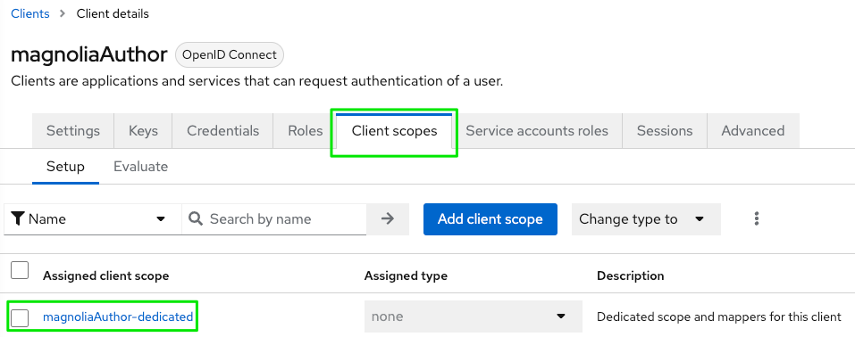
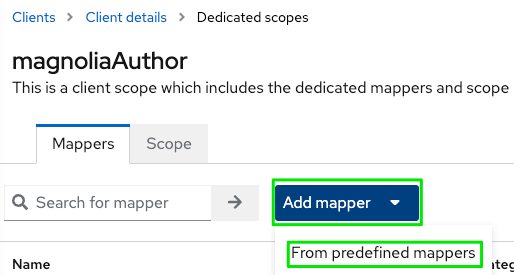

# Magnolia SSO and Keycloak (Quarkus)

!!! info

    Samples and descriptions are based on **Magnolia CMS 6.2.21**, **Magnolia SSO 2.0.4** and **Keycloak 19.0.1**.

## Using a recent Keycloak distribution

!!! caution

    If you are new to the most recent Keycloak distributions based on Quarkus,or if you just upgraded from a WildFly distribution, there are some things you have to consider. You can find more information on the [Migrating to Quarkus distribution](https://www.keycloak.org/migration/migrating-to-quarkus) pages.

### Most important changes in Keycloak to consider

I am not covering changes like how to load configuration at startup time etc, just critical changes regarding the integration with Magnolia SSO.

#### New default context path (without"/auth")

Former URLs like the value used for *oidc.discoveryUri* will not work any longer because the "/auth" part has been removed.

Instead of

`oidc.discoveryUri: http://localhost:8180/auth/realms/mgnl/.well-known/openid-configuration
`

use

`oidc.discoveryUri: http://localhost:8180/realms/mgnl/.well-known/openid-configuration
`

!!! tip

    If you still want/must use the old format (maybe for additional clients you connect to Keycloak), you can start the server with the **http-relative-path** flag, like `bin/kc.[sh|bat] start-dev --http-relative-path /auth`

#### Adding group membership to the token in Keycloak

To be able to apply appropriate permissions on Magnolia AdminCentral, an exernal user needs to "bring" some information about group- (role-) memberships after authentication. Otherwise the Magnolia backend would not be able to resolve correct roles and ACLs.

As the Keycloak administration interface has slightly changed with recent versions, some user might not be able to follow along existing documentation.

**Add group memberships of a user to an ID token:**

- In Keycloak, select your **realm** and the client you want to configure (like *magnoliaAuthor*).
- Choose **Client scopes** => click on **clientName-dedicated**.



- Click on **Add mapper** and **From predefined mappers**.



- Add the **groups** mapper to your client configuration.


- Select the added **groups** mapper to review settings.


---

## Magnolia SSO configuration

!!! note

    Check the official documentation for details about [Magnolia SSO](https://docs.magnolia-cms.com/magnolia-sso/2.0.5/index.html).

### Example config.yaml including groups claim

```yaml
authenticationService:
  path: /.magnolia/admincentral
  callbackUrl: http://localhost:8080/magnoliaAuthor/.auth
  postLogoutRedirectUri: http://localhost:8080/magnoliaAuthor/.magnolia/admincentral
  authorizationGenerators:
    groupsAuthorizationGenerator:
      class: info.magnolia.sso.oidc.GroupsAuthorizationGenerator
      mappings:
        superusers:
          roles:
            - superuser
            - rest-admin
        travel-demo-editors:
          roles:
            - security-base
            - travel-demo-editor
            - workflow-base
            - travel-demo-tour-editor
            - imaging-base
            - travel-demo-admincentral
            - resources-base
  pac4j:
    oidc.id: magnoliaAuthor
    oidc.secret: 10ef547b-a13c-4e59-8228-05f2b528d371
    oidc.scope: openid profile email
    oidc.discoveryUri: http://localhost:8180/realms/mgnl/.well-known/openid-configuration
    oidc.preferredJwsAlgorithm: RS256
```

---

## More hints

### Groups delivered as path

!!! caution

    This example does not have the leading "/" before the group names like shown in the [Magnolia SSO documentation](https://docs.magnolia-cms.com/magnolia-sso/2.0.5/index.html). In former Keycloak versions, there was the default option **"Full group path"** in the protocol mapper (for including the groups claim in the token). As there is no use for Magnolia to receive a single string with several group names, this option is not needed. 
    But if you somehow still are using "full path" groups, then the **mapping in config.yaml** must be adjusted (*/superusers* instead of superusers and */travel-demo-editors* instead of *travel-demo-editors*).

---

## Debugging


For detailed information about what is going on under the covers I recommend to enable debug logging in your Magnolia **development** project.

Either use your [Log4j configuration](https://docs.magnolia-cms.com/product-docs/6.2/Administration/Monitoring.html#_log4j_2) and add

```xml
<Logger name="org.pac4j" level="DEBUG"/>
<Logger name="info.magnolia.sso" level="DEBUG"/>
```

or make use of the [Log Tools app](https://docs.magnolia-cms.com/product-docs/6.2/Apps/List-of-apps/Log-Tools-app.html).

!!! caution

    Do not enable debug logging for security related data in productive environments. If you are forced to enable it, remember to turn it off immediately after use.
    
After getting detailled output for Magnolia SSO, you can track down the problem of a failed setup. For example, to see if and hiw the groups information was added to the user's token after authentication, you could search for **status=200** or for **profile:** and check the data:

**Token response: status=200, content=**

```json
{"access_token":"eyJhbGciOiJSUzI1NiIsInR5cCIgOiAiSldUIiwia2lkIiA6ICJGX1BRWXVqbEh3VEE0TjBndXRsLU1lREJXWHU4a3F1dkVnQmV2Qkx1YkgwIn0.eyJleHAiOjE2NjAzMDUzOTUsImlhdCI6MTY2MDMwNTA5NSwiYXV0aF90aW1lIjoxNjYwMzA1MDk1LCJqdGkiOiIwMjc0NmE2Yi02MmRmLTRkNmEtODY2MS05ZDg2ZDllMDM5ZDAiLCJpc3MiOiJodHRwOi8vbG9jYWxob3N0OjgxODAvcmVhbG1zL21nbmwiLCJhdWQiOiJhY2NvdW50Iiwic3ViIjoiYzM3YzFjNWMtZDIwMS00ZTA0LWFjMTgtNWQ1ODQxYjU5NTU2IiwidHlwIjoiQmVhcmVyIiwiYXpwIjoibWFnbm9saWFBdXRob3IiLCJzZXNzaW9uX3N0YXRlIjoiMWE0OTJiMWQtNWEyMS00NjM1LTllYjgtYzI2NjZhYTZkNmJlIiwiYWxsb3dlZC1vcmlnaW5zIjpbImh0dHA6Ly9sb2NhbGhvc3Q6ODA4MCJdLCJyZWFsbV9hY2Nlc3MiOnsicm9sZXMiOlsic3VwZXJ1c2VycyIsIm9mZmxpbmVfYWNjZXNzIiwidW1hX2F1dGhvcml6YXRpb24iLCJkZWZhdWx0LXJvbGVzLW1nbmwiXX0sInJlc291cmNlX2FjY2VzcyI6eyJhY2NvdW50Ijp7InJvbGVzIjpbIm1hbmFnZS1hY2NvdW50IiwibWFuYWdlLWFjY291bnQtbGlua3MiLCJ2aWV3LXByb2ZpbGUiXX19LCJzY29wZSI6Im9wZW5pZCBlbWFpbCBwcm9maWxlIiwic2lkIjoiMWE0OTJiMWQtNWEyMS00NjM1LTllYjgtYzI2NjZhYTZkNmJlIiwiZW1haWxfdmVyaWZpZWQiOnRydWUsIm5hbWUiOiJTdXBpbmRvIFN1cGVydXNlciIsInBlbmlzIjpbInN1cGVydXNlcnMiLCJvZmZsaW5lX2FjY2VzcyIsInVtYV9hdXRob3JpemF0aW9uIiwiZGVmYXVsdC1yb2xlcy1tZ25sIl0sInByZWZlcnJlZF91c2VybmFtZSI6InN1cGVydXNlciIsImdpdmVuX25hbWUiOiJTdXBpbmRvIiwiZmFtaWx5X25hbWUiOiJTdXBlcnVzZXIiLCJlbWFpbCI6InN1cGVydXNlckBsb2NhbGhvc3QifQ.pOFHfDA1JybJqtog6-YNq2xa0sob7gKYOSUbPZuNwJhYZiKnlNbnCQ7PJm2KYOBhfsSeeudVXsHsjDdKUI0SJU2VjJ1kTuiu_9j5UA_7aoSA8EZWFg1iaPQ3WNuLwQ2EW-zFnOO3S1PEdIg4DxgWhbdQunf51AEyl0hSCGNWdAbjLAyNdoSmB7CB_QgtCjJ7Ru7HO-tLsN8p8zWQEe9xs-5w31jDhP1o764MZ1mYocPUErNe2xt0VtZ-4FBHUf_RetE5YbWXumed2kN44gk38zY1gKM3hotFgzgH-3KVJPmZU7PSIojcbdeCd9q1zZKlDhpGbWaizFB4JR5kvw766Q",
"expires_in":300,
"refresh_expires_in":1800,"refresh_token":"eyJhbGciOiJIUzI1NiIsInR5cCIgOiAiSldUIiwia2lkIiA6ICI5NWY3NTkzZi02MmM3LTRmMDUtYThiMi1mOGM5NzA2ZTg3ODQifQ.eyJleHAiOjE2NjAzMDY4OTUsImlhdCI6MTY2MDMwNTA5NSwianRpIjoiN2M2YzFjNGEtYjkxOS00NmZkLWJkZjgtZTY0NWQ2Y2Q2YzQzIiwiaXNzIjoiaHR0cDovL2xvY2FsaG9zdDo4MTgwL3JlYWxtcy9tZ25sIiwiYXVkIjoiaHR0cDovL2xvY2FsaG9zdDo4MTgwL3JlYWxtcy9tZ25sIiwic3ViIjoiYzM3YzFjNWMtZDIwMS00ZTA0LWFjMTgtNWQ1ODQxYjU5NTU2IiwidHlwIjoiUmVmcmVzaCIsImF6cCI6Im1hZ25vbGlhQXV0aG9yIiwic2Vzc2lvbl9zdGF0ZSI6IjFhNDkyYjFkLTVhMjEtNDYzNS05ZWI4LWMyNjY2YWE2ZDZiZSIsInNjb3BlIjoib3BlbmlkIGVtYWlsIHByb2ZpbGUiLCJzaWQiOiIxYTQ5MmIxZC01YTIxLTQ2MzUtOWViOC1jMjY2NmFhNmQ2YmUifQ.f-BCwrkSQx1wDAkJcCm76qilDngEWq2hfDLsEkIXRoU",
"token_type":"Bearer","id_token":"eyJhbGciOiJSUzI1NiIsInR5cCIgOiAiSldUIiwia2lkIiA6ICJGX1BRWXVqbEh3VEE0TjBndXRsLU1lREJXWHU4a3F1dkVnQmV2Qkx1YkgwIn0.eyJleHAiOjE2NjAzMDUzOTUsImlhdCI6MTY2MDMwNTA5NSwiYXV0aF90aW1lIjoxNjYwMzA1MDk1LCJqdGkiOiJjNjNiNTI1ZS1mYmRkLTRmZDktODc1Yi1lOWY2MTYxYmFhZDciLCJpc3MiOiJodHRwOi8vbG9jYWxob3N0OjgxODAvcmVhbG1zL21nbmwiLCJhdWQiOiJtYWdub2xpYUF1dGhvciIsInN1YiI6ImMzN2MxYzVjLWQyMDEtNGUwNC1hYzE4LTVkNTg0MWI1OTU1NiIsInR5cCI6IklEIiwiYXpwIjoibWFnbm9saWFBdXRob3IiLCJzZXNzaW9uX3N0YXRlIjoiMWE0OTJiMWQtNWEyMS00NjM1LTllYjgtYzI2NjZhYTZkNmJlIiwiYXRfaGFzaCI6InRZODRwTGx0RDF3RUE4ak9jQVByaHciLCJzaWQiOiIxYTQ5MmIxZC01YTIxLTQ2MzUtOWViOC1jMjY2NmFhNmQ2YmUiLCJlbWFpbF92ZXJpZmllZCI6dHJ1ZSwibmFtZSI6IlN1cGluZG8gU3VwZXJ1c2VyIiwicGVuaXMiOlsic3VwZXJ1c2VycyIsIm9mZmxpbmVfYWNjZXNzIiwidW1hX2F1dGhvcml6YXRpb24iLCJkZWZhdWx0LXJvbGVzLW1nbmwiXSwicHJlZmVycmVkX3VzZXJuYW1lIjoic3VwZXJ1c2VyIiwiZ2l2ZW5fbmFtZSI6IlN1cGluZG8iLCJmYW1pbHlfbmFtZSI6IlN1cGVydXNlciIsImVtYWlsIjoic3VwZXJ1c2VyQGxvY2FsaG9zdCJ9.XWE4Bjndf6QmhKhVd35-pPC6VLb8wr-bbiv9SCf8Fpm7pw-N_5dEvp_n3ekX0BZk4Avq-sjUhoNMbv2LQyvQxLE8BHePAtQ7cc7YLQ3afQtKVqIxdWEMaIvScgkvp7swwq6GICxFrB1ayzHVFz4RGTD3Un72RzDf7HrdnVYcdl8LDH4GxiwpelQI3-mrpwHPaLfkAUJGe9uMVr9yxYYvYxVRgmKQ_qry6tsRQGq5p7RSMsie7kmO6lJhw38qPTbj7G68OpF4DsRQSMNNv96WK7_eirkNEndTEa2zTNLnoXMUkNyfAfkraDjGDHErrB5QrsRLvU7HjhRSjZeWOlmFnQ",
"not-before-policy":0,
"session_state":"1a492b1d-5a21-4635-9eb8-c2666aa6d6be",
"scope":"openid email profile"}
```

!!! tip

    Use a tool like [JWT.IO](https://jwt.io) to inspect OpenID Connect JWT token data (in the example above the value for "id_token").