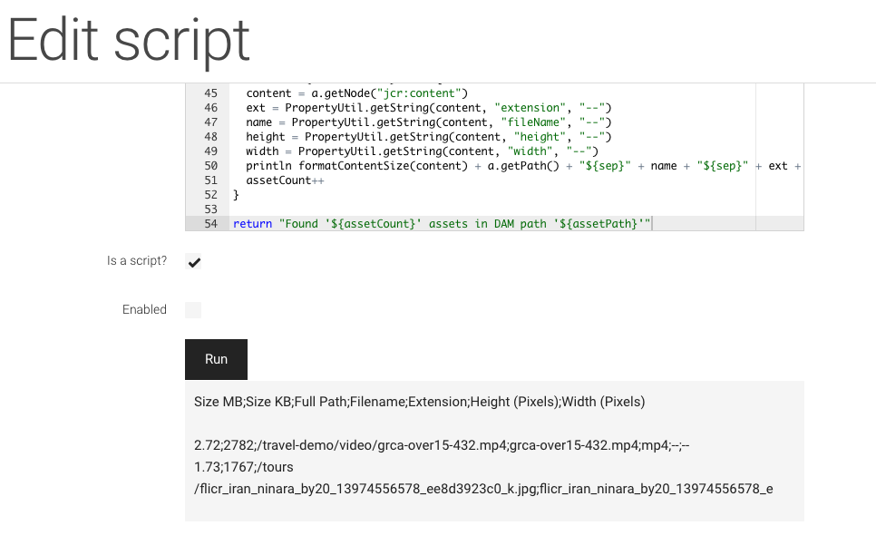
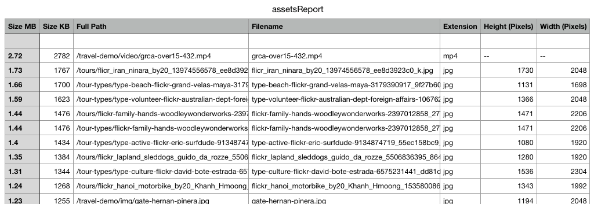

# Create a report showing asset sizes in Magnolia DAM with Groovy

Sometimes editors want to know where big assets are “hidden” in Magnolia DAM. For a project, I quickly created a Groovy script for creating a report listing assets ordered by size.
I used Magnolia's [Groovy App](https://docs.magnolia-cms.com/product-docs/6.2/Apps/List-of-apps/Groovy-app.html) to develop and test the script:



**Groovy script**

```groovy
import javax.jcr.PropertyIterator
import javax.jcr.Property
import java.text.NumberFormat
import java.text.DecimalFormat
import org.apache.commons.lang3.StringUtils

def assetPath = "/"

session = MgnlContext.getJCRSession('dam')
root = session.getNode(assetPath)

// sep char for importing into Numbers / Excel
sep = ";"

numberPatternMB = "###.##"
numberPatternKB = "###"
assetCount = 0

def sortFunction = {a, b ->
  def aAssetSize = PropertyUtil.getLong(a.getNode("jcr:content"), "size")
  def bAssetSize = PropertyUtil.getLong(b.getNode("jcr:content"), "size")
  return bAssetSize.compareTo(aAssetSize)
}

assets = NodeUtil.collectAllChildren(root).findAll { n ->
  n.getProperty("jcr:primaryType").getString() == 'mgnl:asset' && n.hasNode("jcr:content") && n.getNode("jcr:content").hasProperty("size")
}

def formatContentSize(content) {
  fileSizeInBytes = PropertyUtil.getLong(content, "size")  
  fileSizeInKB = fileSizeInBytes / 1024;
  fileSizeInMB = fileSizeInKB / 1024;
 
  sizeMB = StringUtils.replace(new DecimalFormat(numberPatternMB).format(fileSizeInMB), ",", ".")
  sizeKB = StringUtils.replace(new DecimalFormat(numberPatternKB).format(fileSizeInKB), ",", ".")
  
  return sizeMB + "${sep}" + sizeKB + "${sep}"  
}

println "Size MB${sep}Size KB${sep}Full Path${sep}Filename${sep}Extension${sep}Height (Pixels)${sep}Width (Pixels)\n"

// display report
assets.sort(sortFunction).each { a ->
  content = a.getNode("jcr:content")
  ext = PropertyUtil.getString(content, "extension", "--")
  name = PropertyUtil.getString(content, "fileName", "--")
  height = PropertyUtil.getString(content, "height", "--")
  width = PropertyUtil.getString(content, "width", "--")
  println formatContentSize(content) + a.getPath() + "${sep}" + name + "${sep}" + ext + "${sep}" + height + "${sep}" + width
  assetCount++
}

return "Found '${assetCount}' assets in DAM path '${assetPath}'"
```    

You can adapt the code as needed.

!!! note

    **I used a semicolon as column delimiter, as this is the usual default in Switzerland. In Switzerland, number decimals are separated with a point and not with a comma, as in Germany.**

After execution, you can copy & paste the result into the text editor of choice and save the file as text with .csv ending to disk and open it with your preferred spreadsheet application:



Now you are free to add some nice colors and formatting and hand the spreadsheet to your internal or external client…