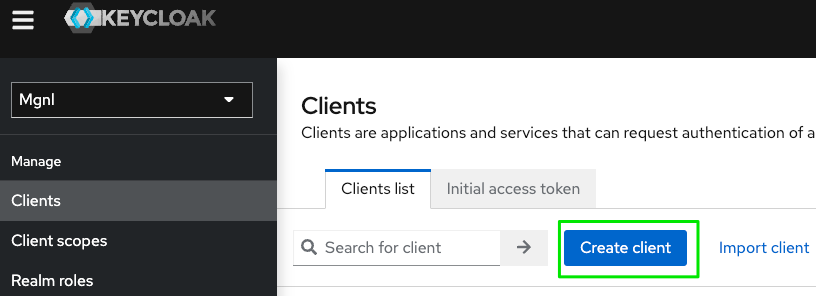
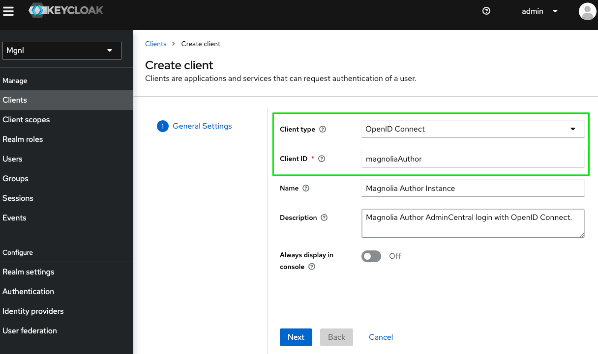
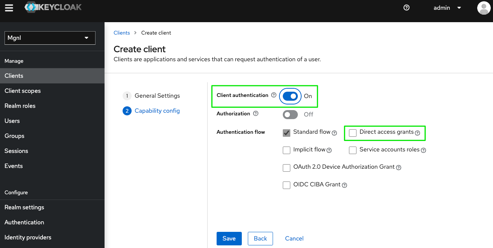
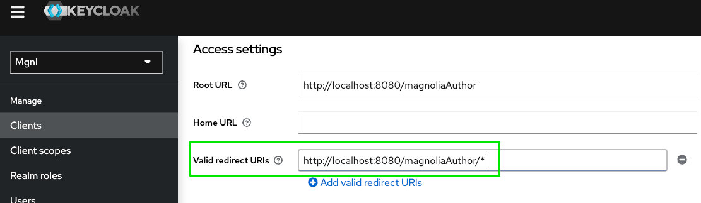
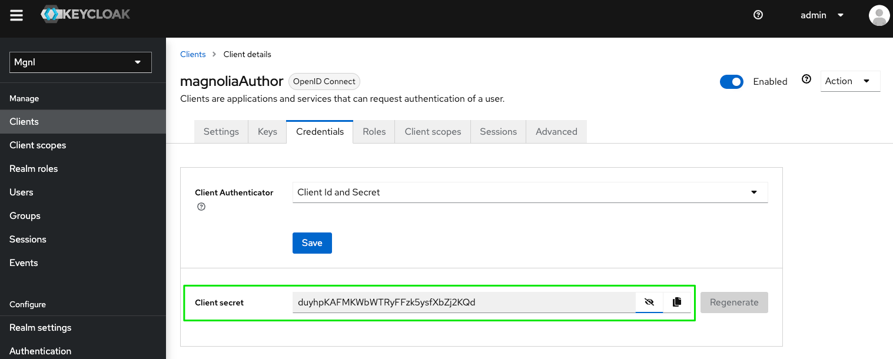

# Keycloak OpenID Connect client setup

The following text shows how to configure Magnolia together with Keycloak from scratch.

It's assumed that you have a running Keycloak instance on localhost, port 8180 and Magnolia is running on localhost port 8080. The context used for magnolia is “*magnoliaAuthor*”. The full URL for Magnolia is:

`http://localhost:8080/magnoliaAuthor`

!!! caution

    If your URLs are different, remember to adjust all samples accordingly.    

---

## Create a Keycloak client

### General setup

The OIDC-based Identity Provider (IdP) needs to know upfront about your Magnolia instance, this is because otherwise any client could try to log in with a user account managed by your personal Keycloak server. 

!!! note

    **The client is created in the “master” realm of Keycloak, which you usually would not do in a productive environment. Think of a realm in Keycloak as of a tenant or a workspace.**

Open the Keycloak administration console `http://localhost:8180/admin` and login with the admin account (admin/admin).

Select **Clients** → Create

Keep **OpenID Connect** as *Client type* and enter a **Client ID** (use a precise short name, especially if you have many clients).

!!! hint
    Copy the value for *Client ID* to a plain text editor. You will need it later for the configuration of SSO.

Click **Next**.

On the *capability config* screen, set **Client authentication** to **ON**. This will provide us a **client secret**, which will be needed for SSO configuration. I also advise **turning off direct access grants** unless you really require it.

**Save** the client.

In the **“Settings” tab**, adjust the following parameters:

- **Root URL**: Server address and context of your application (optional).
- **Valid redirect URIs**: Like the access type, this is essential for OIDC. The redirect URI is also known as a **callback URL**. You can have one or multiple. The redirect URI specifies the path that the identity provider (Keycloak) will use to *call back* after your application initiated the first exchange. It's a security feature that only allows predefined paths to be used for authentication. In our demo example, we use the wildcard path “http://localhost:8080/magnoliaAuthor/*” which is ideal for getting started but it's recommended to be more precise in productive environments and only specify one or more URLs without a wildcard in them.  

!!! caution
    Important regarding redirect URIs is that you have to specify them in the configuration of the Magnolia SSO module. The value on the Magnolia side has to match the one specified in the client configuration of the identity provider.

**Save** your changes.

Switch to the **“Credentials” tab**.

Copy and paste the value for **Client secret** to a plain text editor.

---

### Add group information to the ID token payload

Previous client settings would be enough if authenticated users would all have the same permissions, which is rarely the case when integrating with AdminCentral.

Therefore, we need to add information about group memberships of a user to the OpenID Connect token payload. The Magnolia SSO module later can extract and parse this information from token data and compile permissions for an authenticated user account.

!!! example
    Lookup detailed information in the document [adding-group-membership](keycloak-sso.md#adding-group-membership-to-the-token-in-keycloak).

---

### Optional: Create test users and groups

For testing, it makes sense to create some test users and groups on your Keycloak instance. Define a few users and assign different groups to them. The group names should match the ones on your Magnolia instance to correctly resolve permissions.