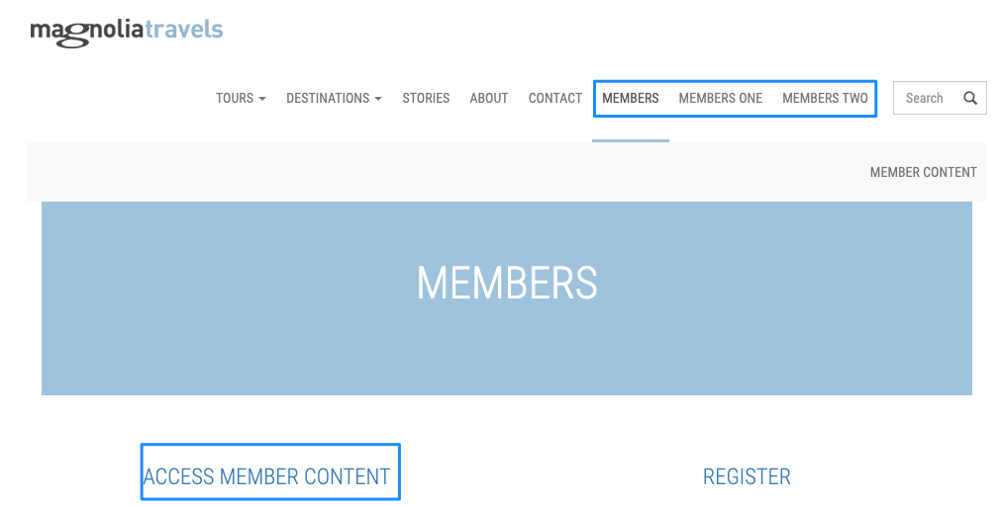
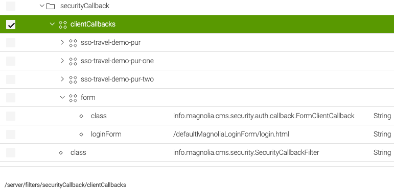
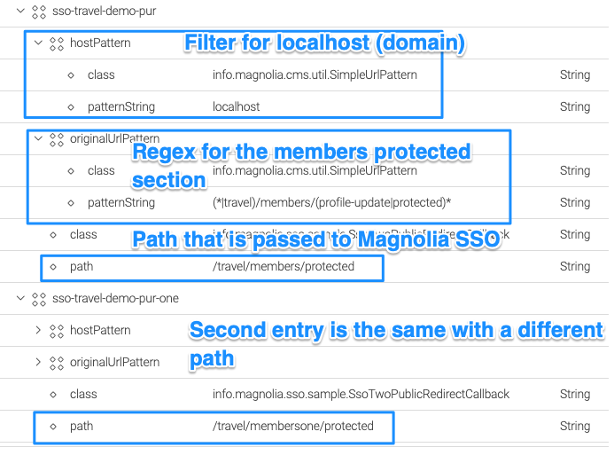
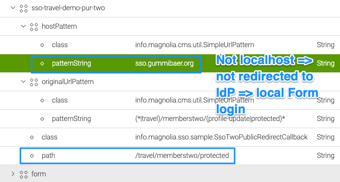
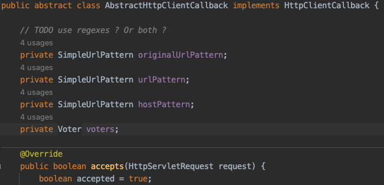

# Magnolia SSO usage on public instances with different paths and filters

There has been the need to protect different paths on a Magnolia public instance using the Magnolia SSO module based on the **domain** where the public instance is running. This means that path protection using the SSO module should depend on host/domain/path filtering.

## Assumptions and requirements

- Magnolia SSO module 2.0.x versions only.
- Usage on a public instance.
- You have already implemented a solution to make Magnolia SSO work with public instances (login and logout classes). See **Publics** article.
- **Workaround, main intend is to show how to implement such a feature without changing Magnolia standard module or library code**.
 
!!! warning

    **This article shows a possible workaround, use the content at your own risk! Test the solution locally first, make a backup of your repository if you cannot just delete it!
    All URLs and paths that should not be accessible by anonymous must be protected bay ACLs (roles) on Magnolia, no matter how authentication is handled. This solution serves as proposal, check if it works out for you and is secure.**

*All tests have been executed with Magnolia SSO 2.0.6, Magnolia 6.2.25 on localhost. The solution should work with other hosts/domains too, but this has not been tested yet.*

---

## Magnolia SSO configuration

We will make use of security callback filters to adjust the path setting for Magnolia SSO dynamically. To prevent Magnolia SSO to take over login for an existing path, we adjust the path configuration in **config.yaml**:

```json
authenticationService:
  path: /dummy/does/not/exist
  callbackUrl: http://localhost:8080/magnoliaPublic/.auth
```
We set the path dynamically when a user tries to access a protected URL.

---

## Sample website



The sample website has 3 different member sections:

- “Members”´: Has a protected member area that needs login if hosted on “localhost”. On “localhost” login with Azure AD.
- “Members one”: Same as members, but has a different path. On “localhost” login with Azure AD.
- “Members two”: Has a different path and as condition a *hostPattern* that is not localhost. On *localhost* login is blocked by showing the Magnolia login form (in this sample).
- AdminCentral (/.magnolia/admincentral): Local Magnolia login form (in this sample).

---

## Security callback filters

Go to */server/filters/securityCallback/clientCallbacks*.



The **form** node is the default one that Magnolia provides. In this configuration, it is triggered whenever a protected URL is accessed by anonymous and none of the previous entries’ “triggers”. 

!!! caution

    **Order is important! If you put “form” on top of the list, you would never be redirected to the IdP for authentication.**

The form is also shown for AdminCentral in this sample. If you wanted to use an external IdP for AdminCentral, you would need an additional entry above the form node (see later in the document).

!!! warning

    **Be careful with these entries. It’s easy to lock yourself out of Magnolia completely!**

---

## Member logins with an IdP triggered on localhost



The first two client callbacks are the same, except they have a different location on the website.

The *hostPattern* says only apply this filter on the host “localhost” → this is optional. If you want to ignore the host, just delete the *hostPattern* node.

The class for the redirect filter is custom, see below

---

## Member login NOT triggered on localhost



The */memberstwo* path has a different host pattern, so redirection does not happen on localhost.

---

## AdminCentral

**AdminCentral is not defined** in *config.yaml* and not in the client *callbacks* list. As it is protected from anonymous access, the last in the queue (the form) is shown when a non-logged-in account wants to access it. This means you can log in with a local Magnolia account.

If you wanted to use an external IdP for login, you would need to add an entry to the list.


!!! caution

    **Order is important → in this example, the entry must be before the form!**

---

## Custom filter class

The class in the previous examples (info.magnolia.sso.sample.SsoTwoPublicRedirectCallback) does take the protected path from the filter configuration (*path*) and puts it dynamically into the Magnolia SSO configuration.

```java
@Override
 public void handle(HttpServletRequest request, HttpServletResponse response) {
    try {
        if (ssoModule != null && ssoModule.getAuthenticationService() != null) {
            log.debug("Applying protected SSO path from redirect callback: " + path);
            // we set the (now matching) path in SSO config, the rest can be 
            // handled by the module
            ssoModule.getAuthenticationService().setPath(path);
        } else {
            log.error("SSO Module and/or authenticationService configuration is NULL.");
        }
        // when using the host pattern in the redirect callback config, the context is not there anylonger,
        // so we make sure to create the correct path ourselves
        String redirectPath = getFullRedirectPath(request, path);
        log.debug("Redirect path: " + redirectPath);

        response.sendRedirect(redirectPath);
    } catch (Exception e) {
        log.error("Problem with redirect.", e);
    }
}
```

This example filter class extends *AbstractHttpClientCallback* → you should inspect the code for getting a clue!



There you can find the default filter options and how they work. If you need something special that is not covered there, you still can put a custom implementation login in there without changing existing code. So if the *hostPattern* (I just tested localhost) somehow does not work, you can add your implementation or adjust the current one.

---

## Additional remarks

Please consider following best practices to keep your project code in a maintainable state.

- Don’t change Magnolia SSO code in the module itself or even in the underlying libraries (PAC4j).
- Put custom code in a custom module and make it depend on Magnolia SSO (META-INF/magnolia) so that it’s loaded AFTER Magnolia SSO.
- Once you tested properly, put configuration changes in a Magnolia version handler.
- You could consider re-setting the current path in Magnolia SSO to the dummy one again after login/logout (try … finally). This way, Magnolia SSO does not take over unwanted control before the client callbacks can trigger → need to find out during testing.
- Basically, this solution does adjust the *singleton* configuration dynamically with a new protected path. If that is not feasible, you could add a login filter class that creates new SSO objects.
