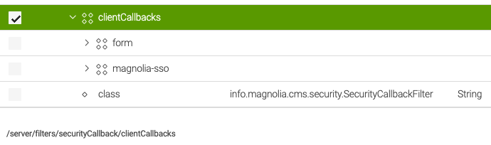
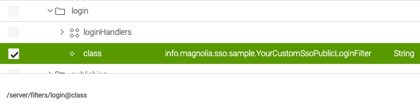
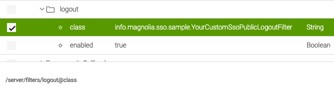

# Magnolia SSO usage on public instances

The main purpose of Magnolia SSO is securing AdminCentral (the backend of Magnolia) on an author instance. In this regard, the code is rather hard-coded, even if there is a “path” variable in the module configuration that you can adjust.

It's possible to use Magnolia SSO to protect parts of a website (like a member section, extranet, etc.). What you have to implement to achieve this, depends on the module version and the use case you want to implement.

I recommend *avoiding the old module version* unless you cannot use Java 11 or higher—Magnolia SSO depends on the [PAC4J library](https://www.pac4j.org/) that itself is a wrapper for the most common Java authentication libraries. As newer versions of Pac4j require at least Java 11, it cannot be used in projects build on Java 8 which is still often the case in Magnolia projects. SSO 3.0.x requires ar least Java 11.

---

## Use cases on public instances

!!! tip

    No matter how you perform a log-in to the Magnolia backend, it's considered best practice to completely block access to AdminCentral from the public internet using network configuration. Allow access only from defined networks or over a VPN connection.

---

### One external IdP for everything

Use **one** external IdP for website protection **and** for access to AdminCentral. Don't use local Magnolia accounts at all.

---

#### Magnolia SSO 3.0.x

With module version 3.0.x, it's possible to use Magnolia SSO on a public instance without changing the source code. Just use the module as is and configure the **path** in your module configuration, like:

```yaml
path: /travel/members/protected
```

**Prerequisites:**

- Log-in is only possible using the address in the *path configuration* (over the protected public website address). No direct access to AdminCentral, like */.magnolia/admincentral*.
- If an account should be able to access AdminCentral, it must have **groups** and/or **roles** assigned from the IdP to compile appropriate permissions. After authentication, such a user can access the Magnolia backend without another log-in.

--- 

#### Magnolia SSO 2.0.x

Similar as version 3.0.x, configuring the **path** in **config.yaml** enables a central log-in **always using the IdP** (no local Magnolia accounts).

You **should replace the logout class**, though, because the log-out does end the session on the IdP, but the user session on Magnolia itself is never properly cleared. This means that it looks like a log-out has been executed, but you can continue to access AdminCentral without another log-in.

See below for a code example regarding a log-out.

---

### Usage of Magnolia user accounts

Magnolia SSO by default assumes that for **all log-in actions, an external IdP is involved**. Therefore, it does not differentiate the user type used for a log-in / log-out. If a user type is not of type *SSOUser*, log-in and log-out will not work because the configured classes cannot handle the user objects.

There are **two common types** of log-in / log-out on public Magnolia instances using local accounts:

- Log-in to AdminCentral using the standard form.
- Having Public User Registration (PUR) functionality on a part of your website—check [Setting up PUR on a website](https://docs.magnolia-cms.com/product-docs/6.2/Modules/List-of-modules/Public-User-Registration-module/Setting-up-PUR-on-a-website.html).

Both use cases will not work out of the box when the Magnolia SSO module is included in your public instance artifact. If you want to make them work, you must provide custom code and configuration (see below).

---

## Code examples

!!! caution

    Please be aware that the following code snippets are just examples, there is no guarantee they will actually work in your project as needed. You will still have to do proper testing.

### Common changes

Some changes are the same no matter if you are using Magnolia SSO 2.0.x or 3.0.x. The samples for log-in and log-out also enable [audit logging in the Magnolia logs](https://docs.magnolia-cms.com/product-docs/6.2/Administration/Monitoring/Audit.html), which you can omit if not needed.

#### Example jaas.config

!!! hint

    If you want to use local logins in any way, your **jaas.config** file needs to have appropriate **login handler configuration**, just having the ones for Magnolia SSO is not enough.

```yaml
magnolia {
  // ensure user is who he claims he is (check pwd for the user)
  info.magnolia.jaas.sp.jcr.JCRAuthenticationModule requisite;
  // retrieve users ACLs
  info.magnolia.jaas.sp.jcr.JCRAuthorizationModule required;
};

sso-authentication {
  info.magnolia.sso.jaas.SsoAuthenticationModule requisite;
  info.magnolia.jaas.sp.jcr.JCRAuthorizationModule required;
};
```

#### Filter configuration

Change configuration by using the *Configuration App* in Magnolia and replace the value for the class attribute with a custom implementation. In a productive project, use a **version handler** instead of adjusting configuration manually.

#### Security callback filter

!!! caution

    The **order of defined client callbacks is important!** If you want to be able to log in to AdminCentral using the regular form and local Magnolia accounts, the **form** entry must be before the **magnolia-sso** one, as shown in the example screenshot. In the concrete sample, both definitions point to /.magnolia/admincentral - if *magnolia-sso* was the first entry in the list, you would never be able to reach the Magnolia log-in form.



---

**Filter for log-in**

*/server/filters/login*



---

**Filter for log-out**

*/server/filters/logout*



---

### Magnolia SSO 3.0.x

To add other user types as the SSOUser, you need to overwrite the **doFilter** methods in the filter classes for log-in and log-out. 

#### Log-in filter

**SsoThreePublicLoginFilter.java** - **doFilter example** 

Basically, we delegate to the default login filter instead to the chain. The rest is adding audit logging capability.

```java
...
@Override
public void doFilter(HttpServletRequest request, HttpServletResponse response, FilterChain chain) throws IOException, ServletException {
    if (Optional.ofNullable(request.getParameter(PARAMETER_LOGOUT)).isPresent()) {
        super.doFilter(request, response, chain);
        return;
    }

    final Config config = pac4jConfig.get();
    final JEEContext context = new JEEContext(request, response);

    config.getSecurityLogic().perform(context, config.getSessionStore(), config, (ctx, sessionStore, profiles, parameters) -> {
      if (profiles.isEmpty()) {                
          // chain.doFilter(request, response);
          
          // => we continue with the regular login filter, this enables the usage of local user accounts
          // otherwise Magnolia SSO tries to handle everything even if we don't want/have an external user
          super.doFilter(request, response, chain);
          return null;
      }

      OidcProfile profile = (OidcProfile) profiles.stream()
        .filter(p -> p instanceof OidcProfile)
        .findAny()
        .orElseGet(OidcProfile::new);

      // login handler part
      CredentialsCallbackHandler callbackHandler = new ExternalUserCallbackHandler(profile);
      LoginResult result = securitySupport.authenticate(callbackHandler, PAC4J_REALM);

      // wrap up the login
      LoginResult.setCurrentLoginResult(result);
      Subject subject = result.getSubject();
      MgnlContext.login(subject);

      // you have to enable audit logging in Magnolia configuration to see an effect
      if (LoginResult.getCurrentLoginResult() != LoginResult.NOT_HANDLED) {
          AuditLoggingUtil.log(LoginResult.getCurrentLoginResult(), request);
      }

      chain.doFilter(new Pac4JHttpServletRequestWrapper(request, profiles), response);
      return null;

    }, config.getHttpActionAdapter(), getClientsAsString(config.getClients()), "none", String.join(" ", config.getMatchers().keySet()));
}
...

```

---

#### Log-out filter

**SsoThreePublicLogoutFilter.java** - **doFilter example** 

In this example, the code checks if the current user is of type **SSOUser**. If not, it means log-in was done using a different user type and log-out is handled in the default filter class. 

```java
...
@Override
public void doFilter(HttpServletRequest request, HttpServletResponse response, FilterChain chain) throws IOException, ServletException {
  if (!Optional.ofNullable(request.getParameter(PARAMETER_LOGOUT)).isPresent()) {
    super.doFilter(request, response, chain);
    return;
  }

  // if login was not performed with SSO, don't continue with this method and use the standard logout filter method
  if (!(MgnlContext.getUser() instanceof SsoUser)) {
    super.doFilter(request, response, chain);
    return;
  }

  // the following is not strictly needed but the standard SSO module does not properly end user sessions on Magnolia itself
  // and a log-in to AdminCentral after a log-out of the member section will not work
  // the code changes also enable audit logging
  log.debug("Performing SSO logout.");
  final Config config = pac4jConfig.get();
  final JEEContext context = new JEEContext(request, response);
  new DefaultLogoutLogic().perform(context, config.getSessionStore(), config, config.getHttpActionAdapter(), getPostLogoutUrl(request), null, true, true, true);
  log.debug("Logout from IdP executed, session should have been removed from the server.");

  // also log out the user from Magnolia, not only on the IdP
  // otherwise log in won't work properly in some cases
  Context ctx = MgnlContext.getInstance();
  if (ctx instanceof UserContext) {
    // log before actual op, to preserve username for logging
    AuditLoggingUtil.log((UserContext) ctx);
    ((UserContext) ctx).logout();
  }
  if (request.getSession(false) != null) {
    request.getSession().invalidate();
  }
  if (chain instanceof MgnlFilterChain) {
    ((MgnlFilterChain) chain).reset();
  }
  log.debug("Magnolia user session has been removed.");

  try {
    Thread.sleep(1000);
  } catch (InterruptedException e) {
  }
}
...

```

---

### Magnolia SSO 2.0.x

You need to apply the same logic and changes as with SSO 3.0.x, just that the code is different. The examples also add **audit logging** and proper Magnolia log-out.

#### Log-in filter

**SsoTwoPublicLoginFilter.java** - **doFilter example**


```java
...
@Override
public void doFilter(HttpServletRequest request, HttpServletResponse response, FilterChain chain) throws IOException, ServletException {
  if (Optional.ofNullable(request.getParameter(PARAMETER_LOGOUT)).isPresent()) {
    super.doFilter(request, response, chain);
    return;
  }

  final Config config = ssoModule.getPac4jConfig();
  final JEEContext context = new JEEContext(request, response, config.getSessionStore());

  config.getSecurityLogic().perform(context, config, (ctx, profiles, parameters) -> {
    if (profiles.isEmpty()) {
      // chain.doFilter(request, response);

      // => we continue with the regular login filter, this enables the usage of local user accounts
      // otherwise Magnolia SSO tries to handle everything even if we don't want/have an external user
      super.doFilter(request, response, chain);
        return null;
    }

    OidcProfile profile = (OidcProfile) profiles.stream().findAny().get();
    Map<String, String> userDetails = assignUserDetails(profile.getDisplayName(), profile.getUsername(), profile.getEmail());

    // login handler part
    CredentialsCallbackHandler callbackHandler = new ExternalUserCallbackHandler(
      userDetails, // Map<String, String> that will get passed to the ExternalUserManager
      profile.getPermissions()
        .stream()
        .map(Object::toString)
        .collect(Collectors.toList())
      );
      LoginResult result = securitySupport.authenticate(callbackHandler, PAC4J_REALM);

      // wrap up the login
      LoginResult.setCurrentLoginResult(result);
      Subject subject = result.getSubject();
      MgnlContext.login(subject);

      // you have to enable audit logging in Magnolia configuration to see an effect
      if (LoginResult.getCurrentLoginResult() != LoginResult.NOT_HANDLED) {
        AuditLoggingUtil.log(LoginResult.getCurrentLoginResult(), request);
      }

      chain.doFilter(new Pac4JHttpServletRequestWrapper(request, profiles), response);
      return null;

      // authorizers = "none" in order to disable pac4j CSRF
  }, config.getHttpActionAdapter(), null, "none", String.join(" " , config.getMatchers().keySet()), null);
}
...

```

---

#### Log-out filter

**SsoTwoPublicLogoutFilter.java** - **doFilter example** 

```java
...
@Override
public void doFilter(HttpServletRequest request, HttpServletResponse response, FilterChain chain) throws IOException, ServletException {
  if (!Optional.ofNullable(request.getParameter(PARAMETER_LOGOUT)).isPresent()) {
    super.doFilter(request, response, chain);
    return;
  }

  // if login was not performed with SSO, don't continue with this method and use the standard logout filter method
  if (!(MgnlContext.getUser() instanceof SsoUser)) {
    super.doFilter(request, response, chain);
    return;
  }

  // the following is not strictly needed but the standard SSO module does not properly end user sessions on Magnolia itself
  // and a log-in to AdminCentral after a log-out of the member section wil not work
  // the code changes also enables audit logging
  final Config config = ssoModule.getPac4jConfig();
  final JEEContext context = new JEEContext(request, response, config.getSessionStore());
  new DefaultLogoutLogic<Object, JEEContext>().perform(context, config, config.getHttpActionAdapter(), getPostLogoutUrl(request), null, null, null, true);

  // also log out the user from Magnolia, not only on the IdP
  // otherwise log in won't work properly in some cases
  Context ctx = MgnlContext.getInstance();
  if (ctx instanceof UserContext) {
    // log before actual op, to preserve username for logging
    AuditLoggingUtil.log((UserContext) ctx);
    ((UserContext) ctx).logout();
  }
  if (request.getSession(false) != null) {
    request.getSession().invalidate();
  }
  if (chain instanceof MgnlFilterChain) {
    ((MgnlFilterChain) chain).reset();
  }
}
...

```

---

## Public IdP configuration example

This example works with the mock server and applies the superuser role to all accounts after authentication. For practical use, you would need to change it to a proper setting. Please see the “path” settings that is protecting the public website area. You still need to protect this area by blocking access for anonymous by using Magnolia roles / ACLs.

```yaml
authenticationService:
  path: /travel/members/protected
  callbackUrl: http://localhost:8080/magnoliaPublic/.auth
  postLogoutRedirectUri: http://localhost:8080/magnoliaPublic
  authorizationGenerators:
    fixedRoleAuthorizationGenerator:
      class: info.magnolia.sso.oidc.FixedRoleAuthorizationGenerator
      roles:
        # change this role as appropriate!
        - superuser
  pac4j:
    oidc.id: my-client
    oidc.secret: my-secret
    oidc.scope: openid profile email
    oidc.discoveryUri:  http://localhost:9090/.well-known/openid-configuration
    oidc.preferredJwsAlgorithm: RS256
```

The mock server was started with Docker like:

```shell    
docker run \
--env PORT=9090 \
--env CLIENT_ID=my-client \
--env CLIENT_SECRET=my-secret \
--env CLIENT_REDIRECT_URI=http://localhost:8080/magnoliaPublic/.auth \
--env CLIENT_LOGOUT_REDIRECT_URI=http://localhost:8080/magnoliaPublic \
-p 9090:9090 \
mgnl/mock-oidc-user-server:latest
```