!!! warning

    **Auth0 does not completely work out of the box with Magnolia SSO!** There are hard-coded parts in Magnolia SSO and in the Nimbus library preventing the SSO module to work properly together with Auth0. For a solution, you need to adjust the Magnolia SSO logout filter code and a constant for parsing group membership from the OIDC token payload. Check back regularly if you need to integrate Auth0 with Magnolia SSO.

!!! information

    Outlined solutions were tested with Magnolia 6.2.27 and Magnolia SSO 3.0.1.

---

# Auth0 OIDC Client Configuration

Auth0 unfortunately does **NOT** run out of the box with Magnolia SSO, at least when the log-out process should work properly and individual permissions are required.

Magnolia SSO makes use of libraries to implement the OIDC protocol. Depending on how you use those libraries, existing flows partially assume hard-coded values that cannot be adjusted in configuration.
As Auth0 uses a slightly different approach for the **log-out** process, we need to provide additional code to make it work in combination with Magnolia SSO.

In addition to this problem, Auth0 does not provide information in the **oidc.logoutURL** about the path to be used for the log-out.

---

## Create the application

As usual, we create an OIDC application in Auth0 under **Applications**.

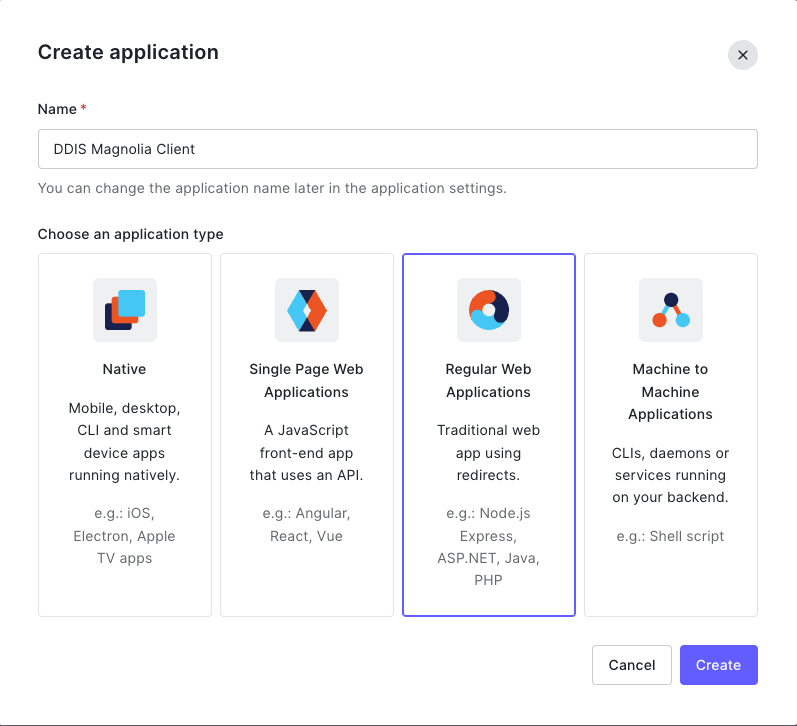    

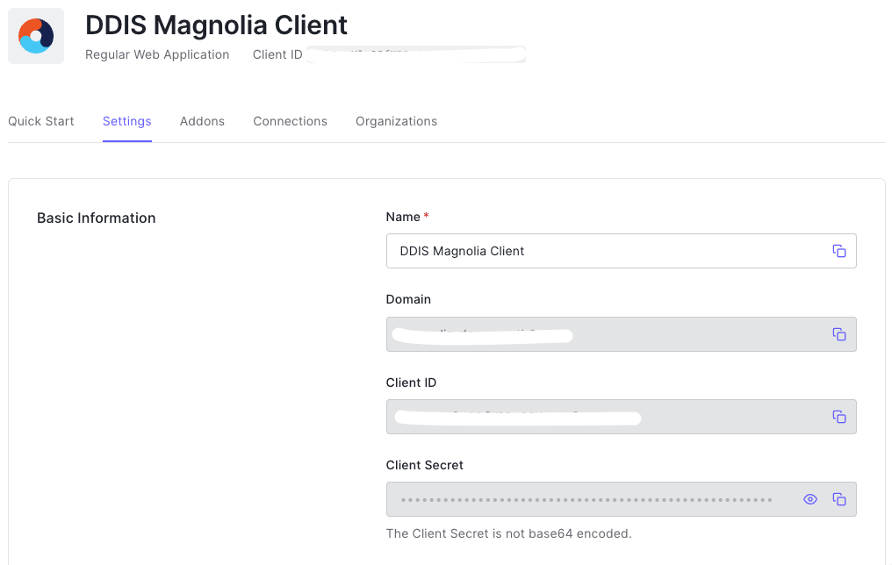 

Copy the values for **Domain**, **Client ID** and **Client Secret** as you will need them for your Magnolia SSO module configuration.

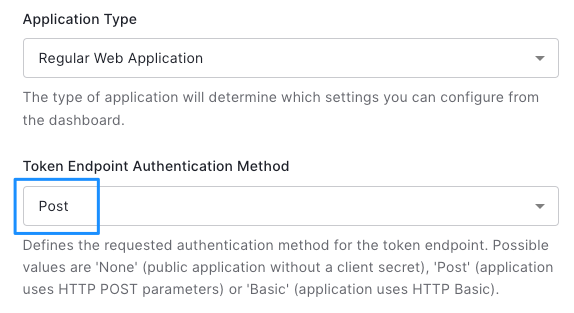  

Configure Callback and Logout URLs according to your current configuration.

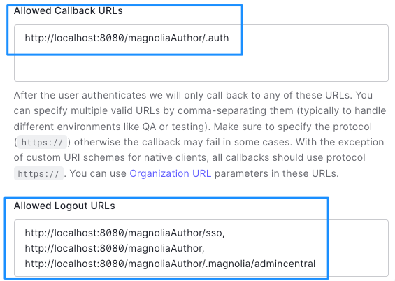 

!!! information

    This configuration is just a starting point, please consider settings that might be mandated by your organization.

---

## Adjust the logout

Basically, we need to set a new LogoutAction builder together with an updated configuration for the Auth0 OIDC client. In the configuration (*OidcConfiguration*) object, we can set a new logout URL.  

---

### Create a new LogoutActionBuilder

We create a new class that overwrites the hard coded values in the Nimbus library (that is used for all the OIDC stuff in PAC4J).

**Auth0SsoLogoutActionBuilde.java**

```java
package org.pac4j.oidc.logout;

import com.nimbusds.openid.connect.sdk.LogoutRequest;
import org.apache.commons.lang3.StringUtils;
import org.pac4j.core.context.WebContext;
import org.pac4j.core.context.session.SessionStore;
import org.pac4j.core.exception.TechnicalException;
import org.pac4j.core.exception.http.RedirectionAction;
import org.pac4j.core.profile.UserProfile;
import org.pac4j.core.util.CommonHelper;
import org.pac4j.core.util.HttpActionHelper;
import org.pac4j.oidc.config.OidcConfiguration;
import org.pac4j.oidc.profile.OidcProfile;
import org.slf4j.Logger;
import org.slf4j.LoggerFactory;

import java.net.URI;
import java.net.URISyntaxException;
import java.util.Optional;

public class Auth0SsoLogoutActionBuilder extends OidcLogoutActionBuilder {

    private static final Logger log = LoggerFactory.getLogger(Auth0SsoLogoutActionBuilder.class);

    private static final String NIMBUS_HARDCODED_REDIRECT_PARAM_NAME = "post_logout_redirect_uri";
    private static final String AUTH0_REDIRECT_PARAM_NAME = "returnTo";

    public Auth0SsoLogoutActionBuilder(final OidcConfiguration configuration) {
        super(configuration);
    }

    @Override
    public Optional<RedirectionAction> getLogoutAction(WebContext context, SessionStore sessionStore, UserProfile currentProfile, String targetUrl) {
        final var logoutUrl = configuration.findLogoutUrl();
        if (CommonHelper.isNotBlank(logoutUrl) && CommonHelper.isNotBlank(targetUrl) && currentProfile instanceof OidcProfile) {
            try {
                final var endSessionEndpoint = new URI(logoutUrl);
                final var idToken = ((OidcProfile) currentProfile).getIdToken();

                LogoutRequest logoutRequest = new LogoutRequest(endSessionEndpoint, idToken, new URI(targetUrl), null);
                String logoutURL = logoutRequest.toURI().toString();

                // post_logout_redirect_uri
                if (StringUtils.containsIgnoreCase(logoutURL, NIMBUS_HARDCODED_REDIRECT_PARAM_NAME)) {
                    logoutURL = StringUtils.replaceIgnoreCase(logoutURL, NIMBUS_HARDCODED_REDIRECT_PARAM_NAME, AUTH0_REDIRECT_PARAM_NAME);

                    if (!StringUtils.containsIgnoreCase(logoutURL, "client_id") && StringUtils.isNotBlank(configuration.getClientId())) {
                        logoutURL += "&client_id=" + configuration.getClientId();
                    }
                }
                return Optional.of(HttpActionHelper.buildRedirectUrlAction(context, logoutURL));
            } catch (final URISyntaxException e) {
                throw new TechnicalException(e);
            }
        }

        return super.getLogoutAction(context, sessionStore, currentProfile, targetUrl);
    }
}
```

---

### Use the LogoutActionBuilder during log out

You need to adjust the class used for log out with a custom one.

!!! important

    **Do not change code directly in the Magnolia SSO module.** Instead, put custom code in a Maven based module and include it into your project.

**CustomLogoutFilter.java**

```java
...
@Override
public void doFilter(HttpServletRequest request, HttpServletResponse response, FilterChain chain) throws IOException, ServletException {

  ...
  
  final Config config = pac4jConfig.get();

  setAuth0LogoutActionBuilder(config, "https://your-auth0-url.eu.auth0.com/v2/logout");

   new DefaultLogoutLogic().perform(config.getWebContextFactory().newContext(request,response), pac4jConfig.getMagnoliaSessionStore(), config, config.getHttpActionAdapter(), getPostLogoutUrl(request), null, true, true, true);

  ...
}

...

private void setAuth0LogoutActionBuilder(Config config, String logoutUrl) {
  config.getClients().getClients().forEach(client -> {
    if (client instanceof OidcClient) {
      OidcClient oidcClient = (OidcClient) client;
      OidcConfiguration oidcConfiguration = oidcClient.getConfiguration();
      // set the logout URL to be used by Auth0
      oidcConfiguration.setLogoutUrl(logoutUrl);

      LogoutActionBuilder mglnSsoLogoutActionBuilder = new Auth0SsoLogoutActionBuilder(oidcConfiguration);
      oidcClient.setLogoutActionBuilder(mglnSsoLogoutActionBuilder);
    }
  });
}

```

---

### Configure the filter in Magnolia

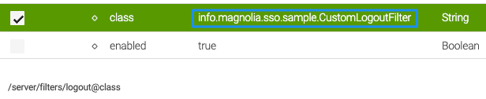

---

## Configuration samples

### Fixed permissions sample

For the first test, a configuration with a **fixedRoleAuthorization** is used. This makes it easier to exclude possible problems with groups/roles/permissions in the beginning.

**Auth0 sample with fixed permissions**

(This configuration does not actually work, it has sample values).

```yaml
path: /.magnolia/admincentral
callbackUrl: http://localhost:8080/magnoliaAuthor/.auth
#postLogoutRedirectUri: http://localhost:8080/magnoliaAuthor/sso
postLogoutRedirectUri: http://localhost:8080/magnoliaAuthor/.magnolia/admincentral
authorizationGenerators:
  - name: fixedRoleAuthorization
    fixed:
      targetRoles:
        - superuser
clients:
  oidc.id: IxbDqtXlx7SfW31rC5UuugZlnPyRnM3E
  oidc.secret: m52ODVoADP3Fb-NPhZjdt-KUy1r-BnNcg9jq2SXKiInHnP_lq76YnjhJPrrmxJrt
  oidc.scope: openid profile email
  oidc.discoveryUri: https://your-auth0-url.eu.auth0.com/.well-known/openid-configuration
  oidc.preferredJwsAlgorithm: RS256
  oidc.authorizationGenerators: fixedRoleAuthorization

userFieldMappings:
  name: nickname
  removeEmailDomainFromUserName: true
  removeSpecialCharactersFromUserName: false
  fullName: name
  email: email
  language: locale
```

---

### Group/Role permissions

Auth0 is quite special compared to the average SSO service. Unfortunately, in the case of Magnolia SSO, this means we have to change the code of the module itself (though it's only a minor change).

Before summer of 2022, it was not possible in Auth0 to add a claim to the OIDC token payload without adding a **namespace** (like https://somenamespace-name/groups). Now you can add a simple claim name to the token. The value **groups** is considered as reserved and that is not allowed to be added to OIDC tokens in Auth0, while in all other SSO providers this does not seem to be an issue. In Magnolia SSO, the name that is used for parsing group membership information, **groups**, is hard-coded and cannot be overwritten by configuration. This means, we need to adjust the name that is used to retrieve group membership of a use from the delivered token data.

---

#### Assign roles to a user

Don't forget to create/assign some actual roles in the Auth0 backend to the user you want to test with.

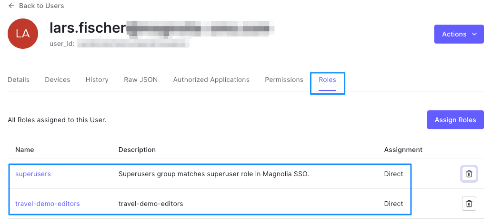

---

#### Add group memberships to the OIDC token in Auth0

There is more than one way to add additional information to a token in Auth0, feel free to use the method you are most comfortable with.

You can find some examples here:

- [Auth0: Add user roles to tokens](https://auth0.com/docs/manage-users/access-control/sample-use-cases-rules-with-authorization#add-user-roles-to-tokens)
- [Auth0: Add user roles to ID and Access tokens](https://auth0.com/docs/customize/actions/flows-and-triggers/login-flow#add-user-roles-to-id-and-access-tokens)
- [Auth0 community: How to add Roles …](https://community.auth0.com/t/how-to-add-roles-and-permissions-to-the-id-token-using-actions/84506)
- [Auth0: Create Custom Claims](https://auth0.com/docs/secure/tokens/json-web-tokens/create-custom-claims)
- [Auth0: Write Your First Action](https://auth0.com/docs/customize/actions/write-your-first-action)

In this example, I will use an Auth0 **action** without a namespace.

#### Create an action

**Add a new custom action**

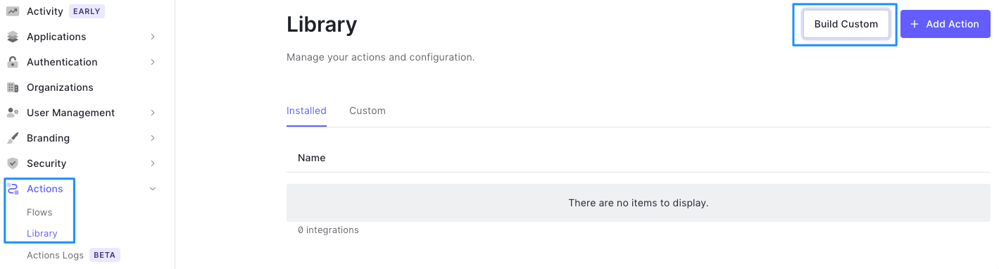  

**Fill in the values as needed**

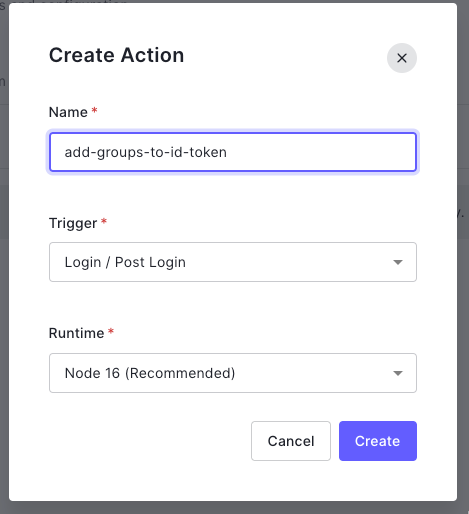

**Create the code for adding token information**

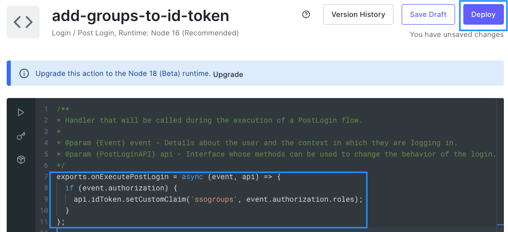

```javascript
exports.onExecutePostLogin = async (event, api) => {
  if (event.authorization) {
    api.idToken.setCustomClaim('ssogroups', event.authorization.roles);
  }
};
```

!!! information

    As stated above, you cannot use the word “groups” in the code above. If you do it, you won't find any group membership information in your token.

When everything is ready, click on the **Deploy** button.

---

#### Adjust the flow

**Select the login flow**

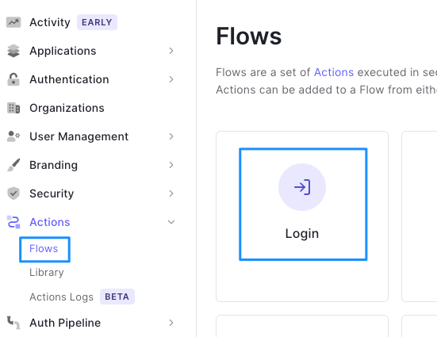

**Add the action to the flow**

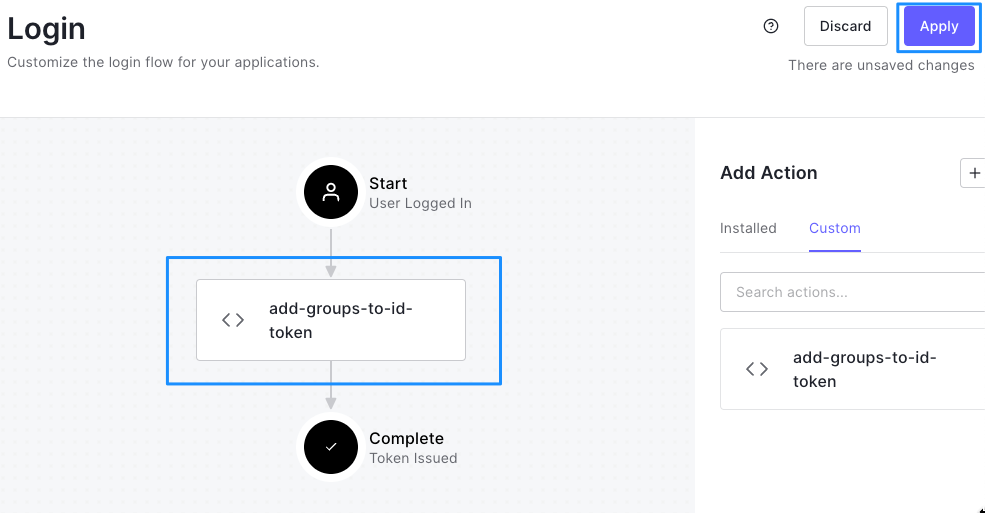

Click on the **Apply** button.

---

#### Adjust group mapping in Magnolia

Change the value for the **TARGET_PROPERTY** constant in the **info.magnolia.sso.oidc.GroupsAuthorizationGenerator** class to match the one that you defined the **Auth0 action** above.

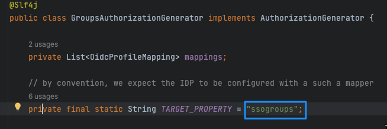 

---

#### SSO config with groups/roles

(This configuration does not actually work, it has sample values).

```yaml
path: /.magnolia/admincentral
callbackUrl: http://localhost:8080/magnoliaAuthor/.auth
#postLogoutRedirectUri: http://localhost:8080/magnoliaAuthor/sso
postLogoutRedirectUri: http://localhost:8080/magnoliaAuthor/.magnolia/admincentral
authorizationGenerators:
  - name: dummyGroupsAuthorization
    groups:
      mappings:
        - name: superusers
          targetRoles:
            - superuser
            - rest-admin
        - name: travel-demo-editors
          targetRoles:
            - security-base
            - travel-demo-editor
            - workflow-base
            - travel-demo-tour-editor
            - imaging-base
            - travel-demo-admincentral
            - resources-base
clients:
  oidc.id: IgbEqgXl79SeW31rC6UoogVlnYyTnM6D
  oidc.secret: c71ODVoACP3Rz-NPhZjdu-KUy4r-AnTcg1jq1SXKoInBnF_lq65YnjcJPrrmsJrh
  oidc.scope: openid profile email
  oidc.discoveryUri: https://your-auth0-url.eu.auth0.com/.well-known/openid-configuration
  oidc.preferredJwsAlgorithm: RS256
  oidc.authorizationGenerators: dummyGroupsAuthorization

userFieldMappings:
  name: nickname
  removeEmailDomainFromUserName: true
  removeSpecialCharactersFromUserName: false
  fullName: name
  email: email
  language: locale
```

---

#### Test the setup

Test your configuration and check the content of the OIDC token.

!!! hint

    You have to enable debug logging to see the entries in the log.

- Search for **Token response: status=200, content=** in the Magnolia logs.
- Copy the line in the log and copy the value for “**id_token**”.
- Paste the value in a tool like https://jwt.io.
- Check the group membership information in the **payload** section.

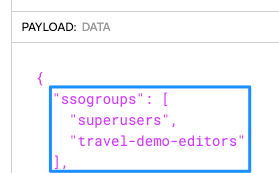  

---

# Summary

Auth0 is quite powerful because you are able to customize the service quite heavily. On the other hand, it's quite different compared to other services and not very easy to configure with standard OIDC libraries. It's also not obvious why Auth0 does not allow adding a **groups** claim to the token, while it's perfectly fine with other SSO providers.


