# Azure AD OpenID Connect client setup

Event though not directly related to Magnolia CMS, developers, and clients keep asking for information about how to set up an OIDC client with Azure AD.

This step-by-step guide was created in October 2022, and I used [Microsoft Entra admin center](https://entra.microsoft.com/) to create the example client. Of course, you can also use [Azure Portal](https://portal.azure.com/) and select Azure AD.

!!! caution

    Azure AD is quite dynamic regarding the user interface because there are many changes. The screenshots might look different after some time has passed, but core functionality rarely changes, especially as essential configuration options are given by the OIDC protocol standard.

## Register a Magnolia client

In Azure Active Directory, create a new “app registration”.

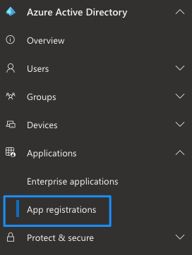

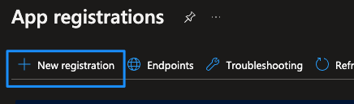

Specify a distinctive **name** and **redirect URI**, also known as **callback URL**. Azure AD will use this address to redirect to after the first contact. It has to be known upfront for any client and has to match with the value Magnolia sends to Azure AD.
You can have more than one redirect URI, but it has to match with the Magnolia one, otherwise the IdP will refuse authentication.

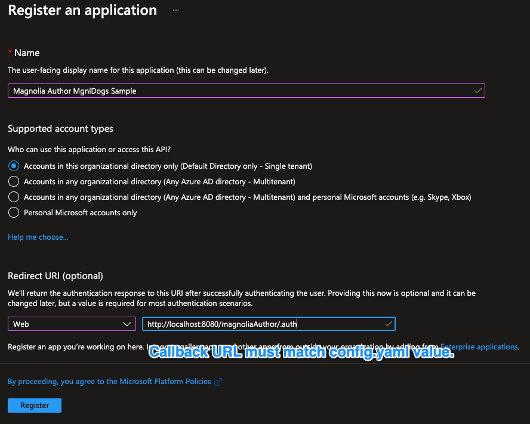

### Hints about the redirect / callback URLs

- The protocol must be **HTTPS**, unless you are using localhost.
- You can specify more than one URI, but the one you are going to use in your Magnolia SSO config.yaml has to be known upfront to the Azure AD client configuration.
- It's not possible to enter a wildcard value into the field for redirect URI, but you can edit the application manifest and edit it there.

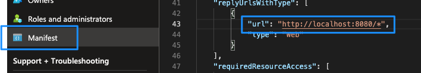

---

### Client configuration

After registration, a few other things have to be defined. In the overview, copy the values for **Application (client) ID** and **Directory (tenant) ID** to a text editor, you will need them later.

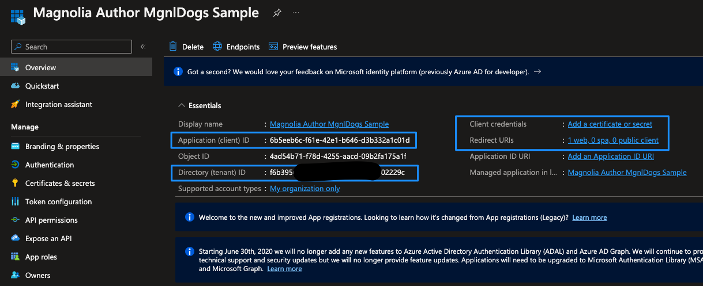

---

### Client secret

Next, create a secret for your application:

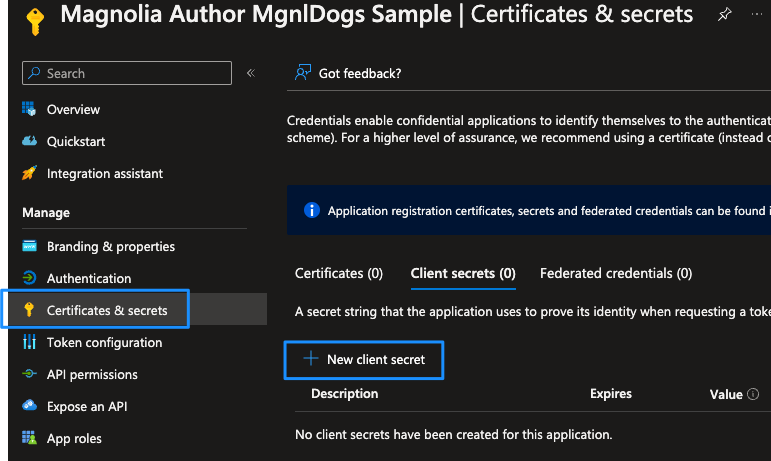

Please consider security objectives in your organization and adjust them accordingly.

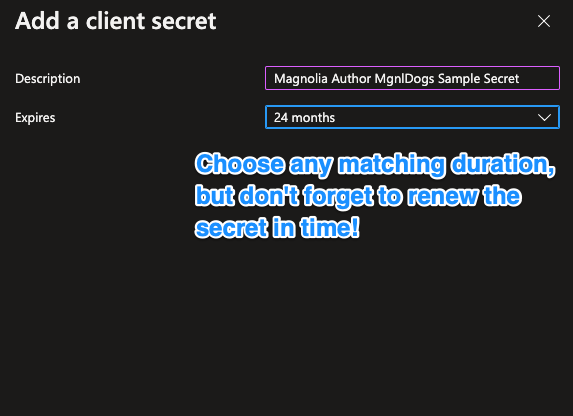

!!! caution

    After creation, **copy the client secret to a text editor**, and remember that the dialog with the value of the secret will not be shown again. If you “lost” the value, you will have to create a new one. Also note that there is an expiration date, so you will have to provide a new secret in time and update Magnolia configurations accordingly.

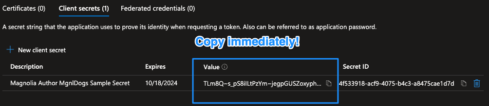

---

## API permissions

After authentication, we use the **access token** to request information about the logged-in user like name, email, groups, etc.
Therefore, we need to add permissions for the client to be allowed to query user information from MS Graph.

Open the **API permissions** dialog for your client, and add permissions:

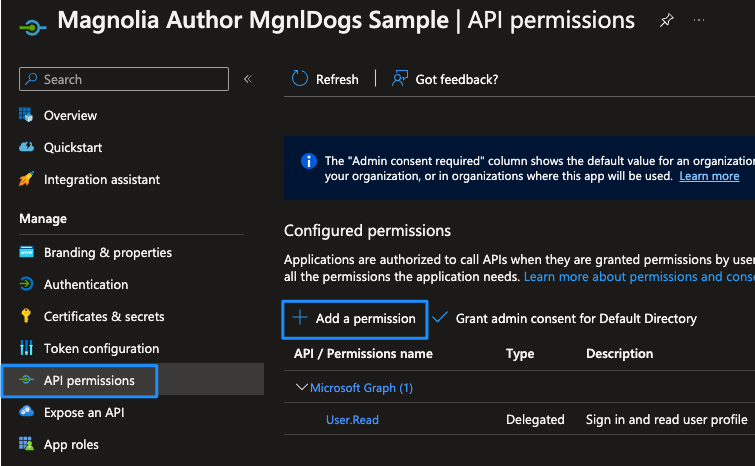

Select **Microsoft Graph**:

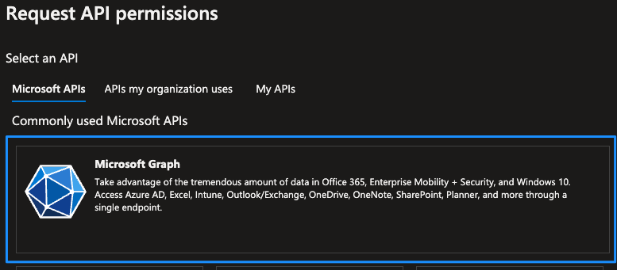

Choose **Delegated Permissions**:

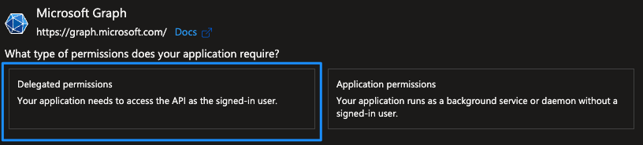

Use the search box to find **Directory.Read.All**, select and add the permission:

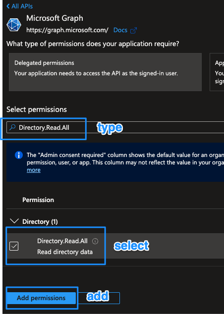

**Grant admin consent** for the permissions and **confirm**:

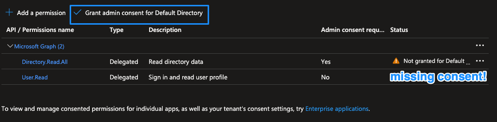

The settings for **API permissions** should look like:

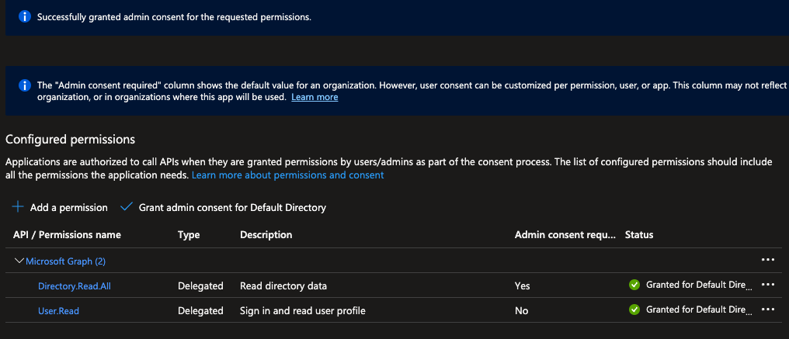

---

## Add groups to the token

This step is optional if group information stored on Azure AD is not required for compiling permissions on your Magnolia instance (which means all users get a fixed permission set, which is unusual on author instances).

By default, group membership of a user is not contained in the token payload Magnolia receives from Azure AD, so we need to add it:

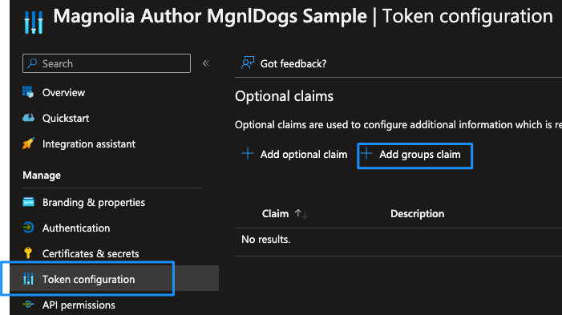

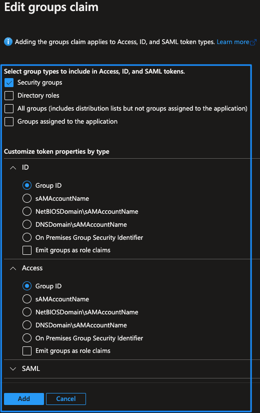

The token configuration should look like this:

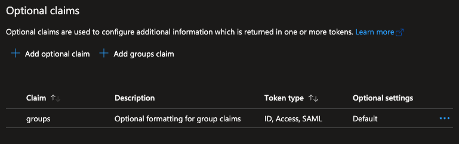

---

#### OIDC token sample

The OIDC token payload contains information about a user’s groups:

```json
{"aud":"c7ac9be3-135c-44e3-bdca-af908715443f","iss":"https://login.microsoftonline.com /yourtenant/v2.0",
"iat":1649757001,"nbf":1649757001,"exp":1649760901,
"groups":["d12cc129-345e-4777-964b-c54371f9da27"],"name":"Wuffi Schnueffelheimer",
"oid":"2491d051-d17c-402e-8322-5fba35c0c897",
"preferred_username":"wuffi@yourtenant.onmicrosoft.com",
"rh":"0.ATEAaZWz9vzZ5kijrTxPvAIinOObrMdcE-NEvcqvkIcVRD8xAD0.",
"sub":"Q7qnV6FtK3uDKVhPvArc0fc_v9pC6jeD8R-5URQJp4w","tid":"f6b39569-d9fc-48e6-a3ad-3c4 fbc02229c",
"uti":"vzIfuMHyhEuapFqXBsfaAA","ver":"2.0"}
```

Without the previous configuration, group data would not be available on the Magnolia instance.

!!! caution

    As seen in the example above, **Azure AD does deliver groups with their IDs and not with their name**. This means that Magnolia has to resolve the names by calling an MS Graph API together with the access token it has received after a user has successfully authenticated.

---

## Users and groups

In the described setup, a user who has authenticated with Azure AD needs at least one group assigned. Otherwise, authentication might work, but there would be no sufficient permissions on the Magnolia instance unless every user has fixed role/group assignments.

### User and group example

#### Azure AD

**Create** a new **user** and **assign** a **group**:

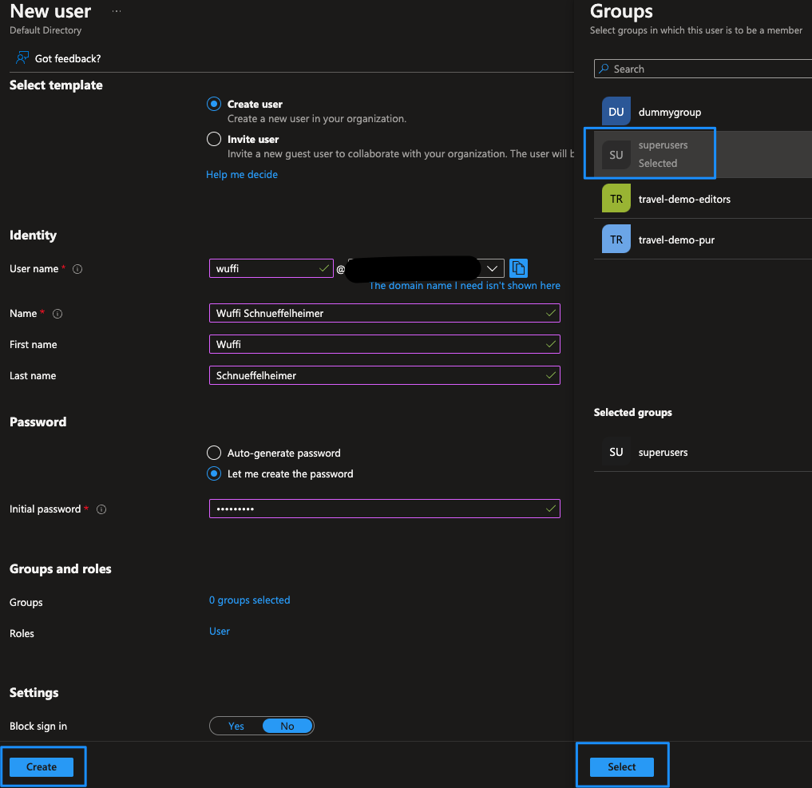

The user in the sample screenshot has the group **superusers** assigned.

---

#### Magnolia author

Magnolia SSO does not map groups/roles delivered with the user to the ones defined in Magnolia directly. In the configuration, you have to create a mapping to match groups/roles for compilation of access rights within Magnolia.

As Azure AD does not deliver the names of groups within the OIDC token payload but instead their unique IDs, you have to create the mappings using the identifiers.

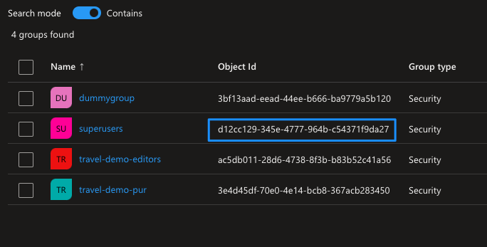

You can make the SSO configuration more readable by adding comments with the name of the group defined in Azure AD.

Example with comments in a *Magnolia SSO 2.0.x* configuration:

```yaml
authorizationGenerators:
  groupsAuthorizationGenerator:
    class: info.magnolia.sso.oidc.GroupsAuthorizationGenerator
    mappings:
      d12cc129-345e-4777-964b-c54371f9da27:  # superusers
        roles:
          - superuser
          - rest-admin
      ac5db011-28d6-4738-8f3b-b83b52c41a56:  # travel-demo-editors
        roles:
          - security-base
          - travel-demo-editor
          - workflow-base
          - travel-demo-tour-editor
          - imaging-base
          - travel-demo-admincentral
          - resources-base
```

The comments are the names of the groups as they are defined in Azure AD (*superusers*, *travel-demo-editors*).

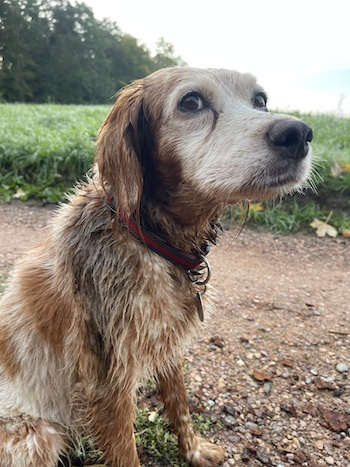
