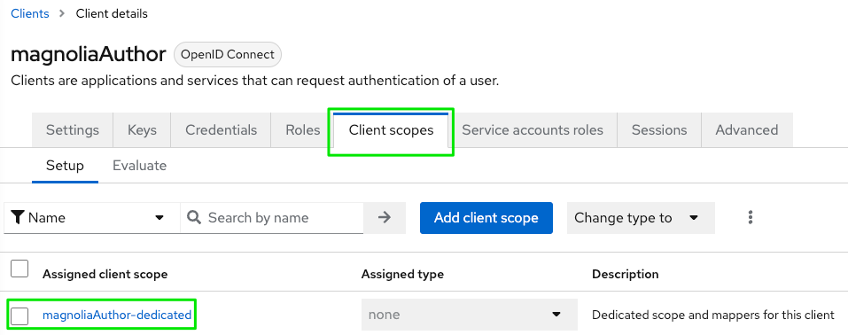
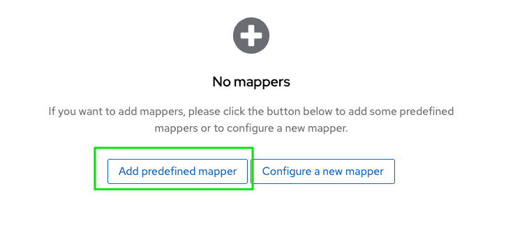
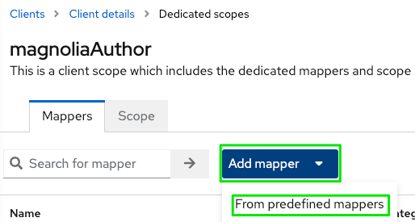
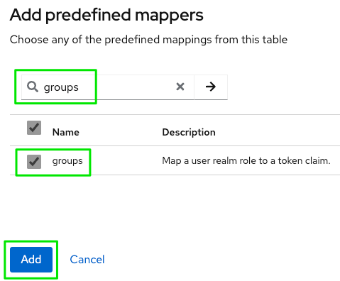
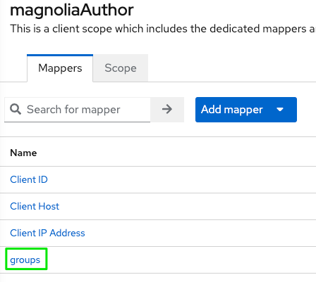

# Keycloak OIDC Client Configuration (Quarkus)

!!! info

    Samples and descriptions are based on **Magnolia CMS 6.2.x**, **Magnolia SSO** **2.0.x** / **3.0.x** and **Keycloak 19.0.x**.

## Using a recent Keycloak distribution

!!! caution

    If you are new to the most recent Keycloak distributions based on Quarkus, or if you just upgraded from a WildFly distribution, there are some things you have to consider. You can find more information on the [Migrating to Quarkus distribution](https://www.keycloak.org/migration/migrating-to-quarkus) pages.

### Most important changes in Keycloak to consider

I am not covering changes like how to load configuration at startup time etc., just critical changes regarding the integration with Magnolia SSO.

#### New default context path (without “/auth”)

Former URLs like the value used for *oidc.discoveryUri* will not work any longer because the “/auth” part has been removed.

Instead of

`oidc.discoveryUri: http://localhost:8180/auth/realms/mgnl/.well-known/openid-configuration
`

use

`oidc.discoveryUri: http://localhost:8180/realms/mgnl/.well-known/openid-configuration
`

!!! tip

    If you still want/must use the old format (maybe for additional clients you connect to Keycloak), you can start the server with the **http-relative-path** flag, like `bin/kc.[sh|bat] start-dev --http-relative-path /auth`.

#### Adding group membership to the token in Keycloak

To be able to apply appropriate permissions on Magnolia AdminCentral, an external user needs to “bring” some information about group- (role-) memberships after authentication. Otherwise, the Magnolia backend would not be able to resolve correct roles and ACLs.

As the Keycloak administration interface has slightly changed with recent versions, some user might not be able to follow along existing documentation.

**Add group memberships of a user to an ID token:**

- In Keycloak, select your **realm** and the client you want to configure (like *magnoliaAuthor*).
- Choose **Client scopes** → click on **clientName-dedicated**.



- Click on **Add predefined mapper**.



If you already defined mappers for your client, the dialog will look different:

- Click on **Add mapper** and **From predefined mappers**.



- Add the **groups** mapper to your client configuration.



- Select the added **groups** mapper to review settings.



---

## Magnolia SSO configuration

!!! caution

    Between Magnolia 2.x and 3.x module versions, there have been breaking changes. You need to apply matching configuration for the SSO module version that you are going to use in your project.

!!! tip

    Check the [Magnolia documentation pages](https://docs.magnolia-cms.com) for details about the module and configuration. Enter “magnolia sso” in the search field to get to the latest documentation. If you don't use the latest version of the module, use the selector to get to the desired variant.

### SSO module 2.0.x version

#### Example config.yaml including groups claim

```yaml
authenticationService:
  path: /.magnolia/admincentral
  callbackUrl: http://localhost:8080/magnoliaAuthor/.auth
  postLogoutRedirectUri: http://localhost:8080/magnoliaAuthor/.magnolia/admincentral
  authorizationGenerators:
    groupsAuthorizationGenerator:
      class: info.magnolia.sso.oidc.GroupsAuthorizationGenerator
      mappings:
        superusers:
          roles:
            - superuser
            - rest-admin
        travel-demo-editors:
          roles:
            - security-base
            - travel-demo-editor
            - workflow-base
            - travel-demo-tour-editor
            - imaging-base
            - travel-demo-admincentral
            - resources-base
  pac4j:
    oidc.id: magnoliaAuthor
    oidc.secret: 10ef547b-a13c-4e59-8228-05f2b528d371
    oidc.scope: openid profile email
    oidc.discoveryUri: http://localhost:8180/realms/mgnl/.well-known/openid-configuration
    oidc.preferredJwsAlgorithm: RS256
```

---

### SSO module 3.0.x version

#### Example config.yaml including groups claim

```yaml
path: /.magnolia/admincentral
callbackUrl: http://localhost:8080/magnoliaAuthor/.auth
postLogoutRedirectUri: http://localhost:8080/magnoliaAuthor/.magnolia/admincentral
authorizationGenerators:
  - name: groupsAuthorization
    groups:
      mappings:
        - name: superusers
          targetRoles:
            - superuser
            - rest-admin
        - name: travel-demo-editors
          targetRoles:
            - security-base
            - travel-demo-editor
            - workflow-base
            - travel-demo-tour-editor
            - imaging-base
            - travel-demo-admincentral
            - resources-base
clients:
  oidc.id: magnoliaAuthor
  oidc.secret: duyhpKAFMKWbWTRyFFzk5ysfXbZj2KQd
  oidc.scope: openid profile email
  oidc.discoveryUri: http://localhost:8180/realms/mgnl/.well-known/openid-configuration
  oidc.preferredJwsAlgorithm: RS256
  oidc.authorizationGenerators: groupsAuthorization

userFieldMappings:
  name: preferred_username
  removeEmailDomainFromUserName: true
  removeSpecialCharactersFromUserName: false
  fullName: name
  email: email
  language: locale
```

---

#### Example config.yaml with fixed superuser role

Use this for only for initial testing and rescue operations.

```yaml
path: /.magnolia/admincentral
callbackUrl: http://localhost:8080/magnoliaAuthor/.auth
postLogoutRedirectUri: http://localhost:8080/magnoliaAuthor/.magnolia/admincentral
authorizationGenerators:
  - name: fixedRoleAuthorization
    fixed:
      targetRoles:
        - superuser
clients:
  oidc.id: magnoliaAuthor
  oidc.secret: duyhpKAFMKWbWTRyFFzk5ysfXbZj2KQd
  oidc.scope: openid profile email
  oidc.discoveryUri: http://localhost:8180/realms/mgnl/.well-known/openid-configuration
  oidc.preferredJwsAlgorithm: RS256
  oidc.authorizationGenerators: fixedRoleAuthorization

userFieldMappings:
  name: preferred_username
  removeEmailDomainFromUserName: true
  removeSpecialCharactersFromUserName: false
  fullName: name
  email: email
  language: locale
```

---

## Keycloak-specific configuration

The values for **callbackUrl**, **oidc.id** and **oidc.scope** are coming from your Keycloak OIDC application. Others, like **oidc.scope**, **oidc.discoveryUri** and **oidc.preferredJwsAlgorithm** are the default values for Keycloak according to the OpenID Connect protocol standards. 

---

## Keycloak group mapping

### Groups delivered as path

!!! caution

    This example does not have the leading “/” before the group names, as shown in the [Magnolia documentation](https://docs.magnolia-cms.com). In former Keycloak versions, there was the default option **“Full group path”** in the protocol mapper (for including the groups claim in the token). As there is no use for Magnolia to receive a single string with several group names, this option is not needed. 
    But if you somehow still are using "full path" groups, then the **mapping in config.yaml** must be adjusted (*/superusers* instead of superusers and */travel-demo-editors* instead of *travel-demo-editors*).
