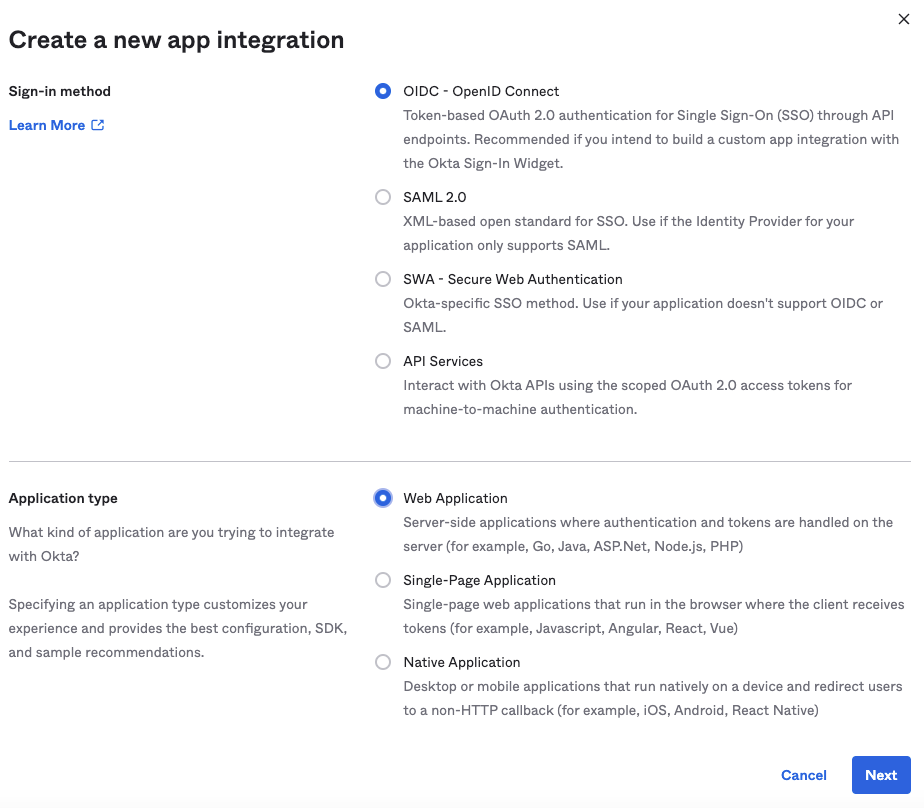
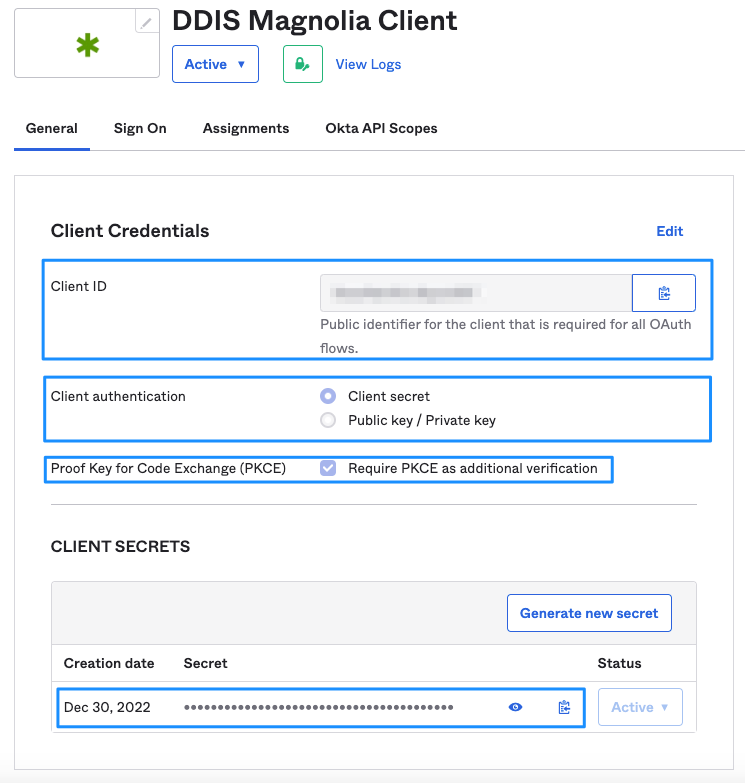
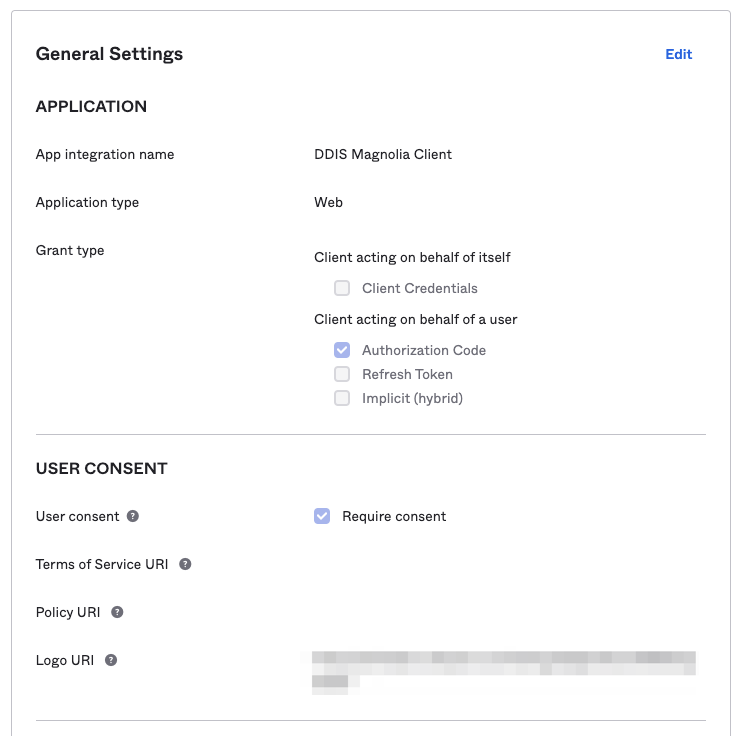
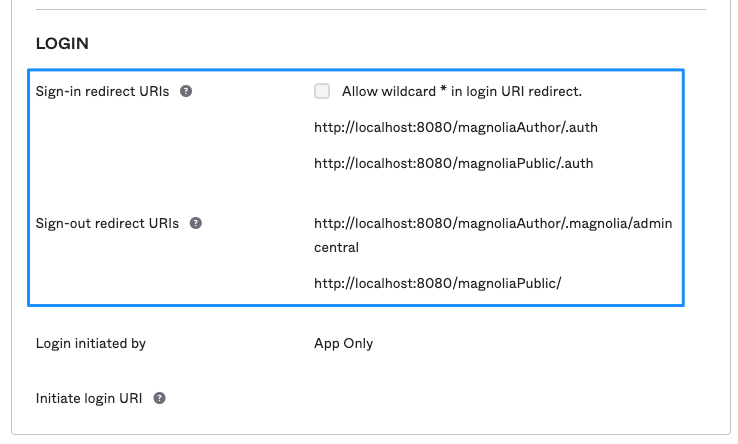
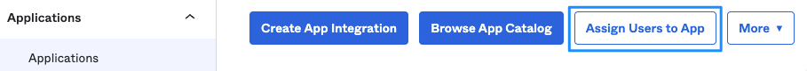
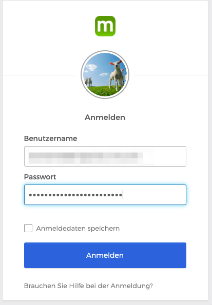
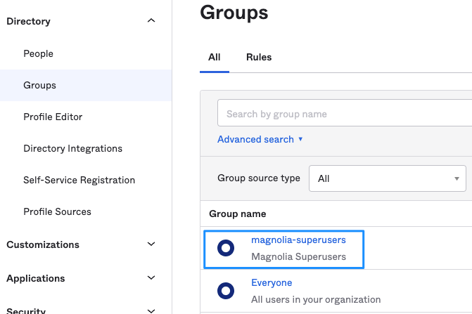
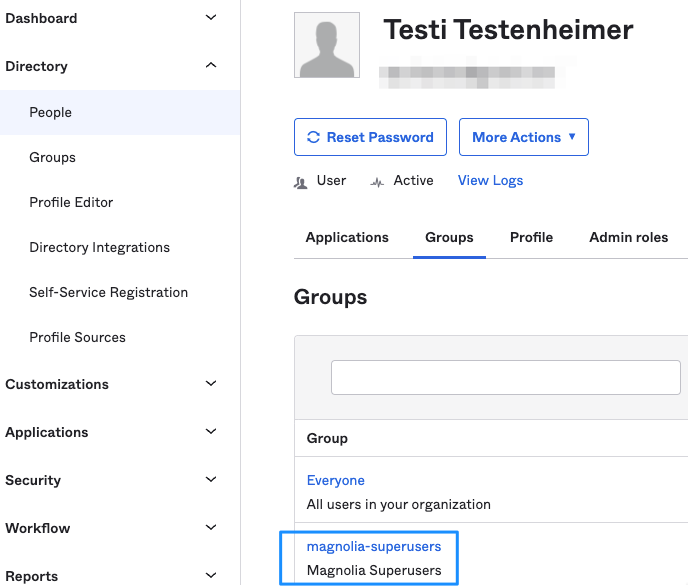
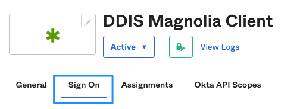
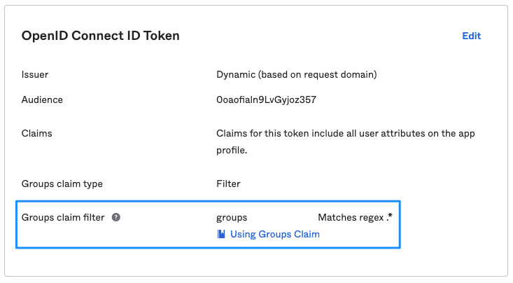

# Okta OIDC client configuration

!!! info

    The following article was created using Magnolia 6.2.27 and [Magnolia SSO 3.0.0](https://docs.magnolia-cms.com/magnolia-sso/3.0.0/index.html).

## OIDC web application in Okta

As usual, login to your Okta console with appropriate permissions and under **Applications/Applications** create a new **App Integration**. Select **OIDC** and **Web Application** (your Magnolia instance).



---

## Application settings

### General settings

Give your application a meaningful name and copy the values for 

- Client ID
- Client Secret

to a text editor. You will need them for the configuration of Magnolia SSO.



!!! tip

    I recommend that you enable the **Proof Key for Code Exchange (PKCE)** setting. In our case, when you can store sensitive information on the server side, it's not strictly needed, but the option adds a layer of security. 
    The setting would be absolutely mandatory if you would integrate a browser-only app (SPA) with your IdP.



---

### Sign-in and sign-out

Add the URIs that are allowed for sign-in and sign-out (you can have multiple). At least one of them has to match the configuration value for **callbackUrl** and **postLogoutRedirectUri** in your Magnolia SSO **config.yaml**.

```yaml
path: /.magnolia/admincentral
callbackUrl: http://localhost:8080/magnoliaAuthor/.auth
postLogoutRedirectUri: http://localhost:8080/magnoliaAuthor/.magnolia/admincentral
```

!!! hint

    You don't need to add the URIs for **magnoliaPublic** to protect AdminCentral. I have added them to be able to use one Okta OIDC client configuration for both author and public instances.



!!! info

    Please use correct URIs matching your actual setup and also consider the context—in this example magnoliaAuthor and magnoliaPublic.

---

## Example configuration for Magnolia SSO

!!! info

    For all tests, you need a **user account** on your Okta instance who is **assigned to the OIDC application** we previously created. You (or your admin) can manage assignments on the Okta console.

    

---

### Fixed permission set

It's often easier to start with a fixed set of permissions when testing a new login integration because assigning groups/roles can sometimes be a difficult task (depending on the provider).

We are going to configure a **fixedRoleAuthorization** authorization generator. This means every user receives the same set of group/role assignments after **successful authorization** (sign-in) with Okta. All users will receive the superuser role. Of course, you can assign different permissions.

**Configuration example:**

- SSO integration for a Magnolia author instance.
- The Magnolia instance is running under http://localhost:8080/magnoliaAuthor. You might need to adjust this to your environment.
- Adjust values coming from Okta (see above) as needed. The value in the sample file are made up.

```yaml
path: /.magnolia/admincentral
callbackUrl: http://localhost:8080/magnoliaAuthor/.auth
postLogoutRedirectUri: http://localhost:8080/magnoliaAuthor/.magnolia/admincentral
authorizationGenerators:
  - name: fixedRoleAuthorization
    fixed:
      targetRoles:
        - superuser
clients:
  oidc.id: 0oaotieln8LxGtjoz256
  oidc.secret: NYrJzl_QOpWnVcBKQQj6PQSqaLiWlIKq4H1p-Z21
  oidc.scope: openid profile email
  oidc.discoveryUri: https://your-own-tenant.okta.com/.well-known/openid-configuration
  oidc.preferredJwsAlgorithm: RS256
  oidc.authorizationGenerators: fixedRoleAuthorization

userFieldMappings:
  name: name # the name has to match an actually existing attribute coming from Okta!
  removeEmailDomainFromUserName: true
  removeSpecialCharactersFromUserName: false
  fullName: name
  email: email
  language: locale
```

**Test the login**

If you configured everything as needed, Okta should take over authentication when you access Magnolia AdminCentral on http://localhost:8080/magnoliaAuthor/.



The next thing you should see is AdminCentral, in this example with superuser permissions.


---

### Dynamic group/role/permissions assignment

Assigning group and role information dynamically, in a Magnolia SSO integration scenario, can be considered as the holy grail in IT. Once you mastered this, you can solve any problem that could ever stand in your way 😀

To make the task even more interesting, every IdP handles this kind of feature differently.

!!! info

    Magnolia SSO parses the OIDC token payload for **group** data. Basically, you make Okta deliver a user's group membership information within the ID token. Magnolia SSO parses token data for an attribute called **groups** and then matches the group **names** to existing local group names on the Magnolia instance. If a group name delivered from Okta is found on Magnolia, it is added to the user object that was created on the fly after a successful authentication with Okta. Groups not existing on Magnolia are ignored. In the end, ACLs are compiled from the assigned permission set, and the user should have needed roles and access rights.

---

#### Okta user and group configuration

Create a group on Okta that you want to apply to the test user.



Don't forget to actually **assign the group** to the test user!



---

#### Add groups to the OIDC token payload

Currently, the ID token does not contain information about group membership of an authenticated user, no matter what was assigned previously to the test use in the Okta console.

To add groups to the token data, edit your OIDC app configuration:



Edit the **Groups claim filter**:

- Groups claim: **groups**
- Matches regex:.*



See [Customize tokens returned from Okta with a Groups claim](https://developer.okta.com/docs/guides/customize-tokens-groups-claim/main/) for more information.

🤓 Cool! Now group information will be delivered to Magnolia in the ID token payload? **No!** 🤬 Read about the **scope** setting below.

---

#### Magnolia SSO configuration

- SSO integration for a Magnolia author instance.
- The Magnolia instance is running under http://localhost:8080/magnoliaAuthor. You might need to adjust this to your environment.
- Adjust values coming from Okta (see above) as needed. The value in the sample file are made up.

```yaml
path: /.magnolia/admincentral
callbackUrl: http://localhost:8080/magnoliaAuthor/.auth
postLogoutRedirectUri: http://localhost:8080/magnoliaAuthor/.magnolia/admincentral
authorizationGenerators:
  - name: groupsAuthorization # not any longer the fixedRoleAuthorization! 
    groups:
      mappings:
        - name: magnolia-superusers # magnolia-superusers group in Okta
          targetRoles:
            - superuser
            - rest-admin
        - name: travel-demo-editors # travel-demo-editors group in Okta
          targetRoles:
            - security-base
            - travel-demo-editor
            - workflow-base
            - travel-demo-tour-editor
            - imaging-base
            - travel-demo-admincentral
            - resources-base
clients:
  oidc.id: 1otofieln3LvGyioz356
  oidc.secret: NYuJzl_PPpQnVaMKQYj9PQSqoLoWlIKq8H4p-X66
  oidc.scope: openid profile email groups # you need to add the groups claim!
  oidc.discoveryUri: https://your-own-tenant.okta.com/.well-known/openid-configuration
  oidc.preferredJwsAlgorithm: RS256
  oidc.authorizationGenerators: groupsAuthorization # not any longer the fixedRoleAuthorization!

userFieldMappings:
  name: name # the name has to match an actually existing attribute coming from Okta!
  removeEmailDomainFromUserName: true
  removeSpecialCharactersFromUserName: false
  fullName: name
  email: email
  language: locale
```

!!! important

    Okta requires adding **groups** to the scope configuration. Otherwise, group data will not be delivered with the authenticated user data!

**Test the setup:**

As with the fixed permission set, Okta should handle authentication and permissions should be applied from group data and the module configuration.


---

## One more thing

Once logging into Magnolia works with your setup, you should **test if logging out also works**: Ending the session on Magnolia and Okta, ending up with the Okta login form (or a destination you defined in configuration). With some providers (like Auth0), a proper log out is way harder to achieve than a login.

## Conclusion

Using Magnolia SSO together with Okta is quite handy if you know how to do it. 😌

See also [Debugging](/Magnolia%20SSO%20Module/Troubleshooting/debugging/) if your setup does not work …
