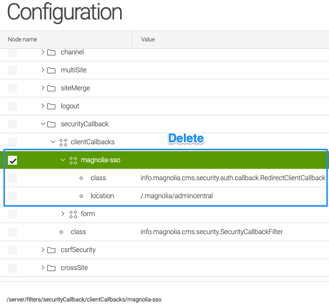
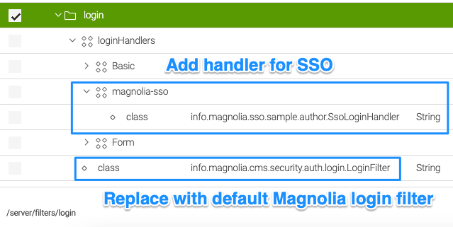
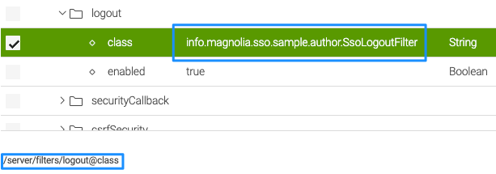
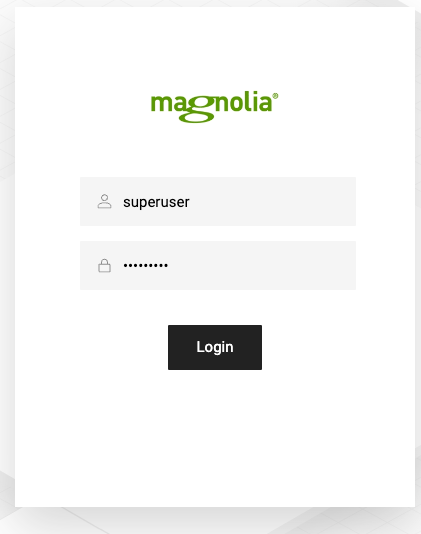
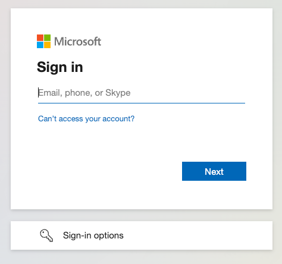
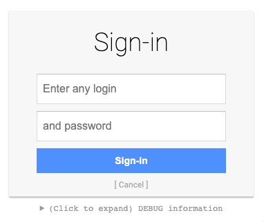

# Multiple login handlers on a Magnolia author

This document aims to provide a workaround to enable local or other login handlers (like LDAP) besides an IdP that is handled by the Magnolia SSO module.

!!! note

    By the time of writing, there can be “only” one external IdP managed by the Magnolia SSO module at the same time. If you need to support more than one IdP (like Azure AD), which is very unusual, then you need to configure one provider as “hub” for other user account providers.

As Magnolia SSO by default manages all login processes by replacing the login filter class, some structural (and code) changes are needed.

!!! tip

    **Please do not change classes or configuration changes in the Magnolia SSO module directly. Use a custom module that depends on Magnolia SSO and replace the configuration in a version handler.**

---

## Magnolia configuration changes

### Security callback filter

Delete the security callback node for Magnolia SSO or move it to the very bottom if you want to keep it for reference (it must be below the **form** node). This callback is obsolete, as the **path** attribute in the Magnolia SSO YAML config defines what is protected.



---

### Login filter and handler

Replacing the login filter with a login handler does consider the default Magnolia configuration and makes it possible to have more than one provider for logins at the same time.
The SSO login process is only triggered when it is considered responsible for the login.



- Add a handler for Magnolia SSO and set your custom login handler class (name is just an example).
- Replace the **class** for /server/filters/login with the Magnolia default **info.magnolia.cms.security.auth.login.LoginFilter**.

---

**Example code for an SSO login handler:**

Basically, we move the main logic from the Magnolia SSO login filter to the **login handler**:

```java
public class SsoLoginHandler extends LoginHandlerBase implements LoginHandler {

...

@Override
public LoginResult handle(HttpServletRequest request, HttpServletResponse response) {
    // only when not already logged in!
    if (UserManager.ANONYMOUS_USER.equals(MgnlContext.getUser().getName())) {
        log.debug("SSO login handler.");
        final Config config = pac4jConfig.get();
        final JEEContext context = new JEEContext(request, response);

        config.getSecurityLogic().perform(context, config.getSessionStore(), config, (ctx, sessionStore, profiles, parameters) -> {
            if (profiles.isEmpty()) {
                return LoginResult.NOT_HANDLED;
            }
            log.debug("Perform login with SSO.");
            OidcProfile profile = (OidcProfile) profiles.stream()
                    .filter(p -> p instanceof OidcProfile)
                    .findAny()
                    .orElseGet(OidcProfile::new);
              
            // login handler part
            CredentialsCallbackHandler callbackHandler = new ExternalUserCallbackHandler(profile);
            LoginResult result = securitySupport.authenticate(callbackHandler, PAC4J_REALM);

            // wrap up the login
            LoginResult.setCurrentLoginResult(result);
            Subject subject = result.getSubject();
            MgnlContext.login(subject);

            return result;
            // authorizers = "none" in order to disable PAC4J CSRF
       }, config.getHttpActionAdapter(), getClientsAsString(config.getClients()), "none", String.join(" ", config.getMatchers().keySet()));

       // redirect to Identity Provider to handle authentication
       if (response.getStatus() == 302) {
           log.debug("Redirect to IdP required.");
           try {
               response.sendRedirect(response.getHeader("Location"));
           } catch (IOException e) {
               log.error("Problem while redirecting to IdP:", e);
           }
       }
   }
   // you have to enable audit logging in Magnolia configuration to see an effect
   if (LoginResult.getCurrentLoginResult() != LoginResult.NOT_HANDLED) {
       AuditLoggingUtil.log(LoginResult.getCurrentLoginResult(), request);
   }
   return LoginResult.NOT_HANDLED;
}

...
}
```

You can also add more checks or logic when the handler actually should take over for logging in. The main idea is that instead of one login filter handling everything, a list of handlers is called to check who is responsible to handle authentication.
As a side node, the method also adds audit logging.

---

### Logout filter

The logout filter also needs changes because the one provided by Magnolia SSO is not checking the type of use who has logged in before. If it is the case it was not an SSO user (like a local Magnolia one), the session cannot be ended properly.

As a template for the logout filter, you can use the code from the [Publics article](/Magnolia%20SSO%20Module/Special%20Use%20cases/publics/#log-out-filter).

You also need to replace the class in the existing logout filter configuration:



---

## Testing the setup

You can use your own Magnolia SSO setup or use the [Docker mock server](/Magnolia%20SSO%20Module/Troubleshooting/lost-access/#provide-a-mock-environment).

### Local login

!!! hint

    If LDAP is configured with your Magnolia instance, it should also work!

Access the default Magnolia login with


http://localhost:8080/magnoliaAuthor/

or 

http://localhost:8080/magnoliaAuthor/.magnolia

(replace with actual server/port/context).

You should be able to log in using the standard Magnolia form.



The replaced logout filter does consider the local (LDAP) user type.

---

### SSO login

Use the “full” AdminCentral URL with

http://localhost:8080/magnoliaAuthor/**.magnolia/admincentral**

to login in with your IdP—in this example, Azure AD (replace with actual server/port/context).



A test with the mock server:



---

## Tip: Define a virtual URI mapping for SSO

If you want to have a more handy URL for SSO logins, you can make use of a [Virtual URI mapping](https://docs.magnolia-cms.com/product-docs/6.2/Administration/URI-mapping/Virtual-URI-mapping.html).

Just add such a mapping to your configuration (YAML or JCR) to have a shortcut:

```yaml
class: info.magnolia.virtualuri.mapping.DefaultVirtualUriMapping
fromUri: /sso
toUri: redirect:/.magnolia/admincentral
```

This way, you can use **{your-instance-address}/sso** instead of **/.magnolia/admincentral**, like

http://localhost:8080/magnoliaAuthor/sso.

!!! information

    If you are going to use virtual URIs, don't forget to add needed configuration changes for the redirect URIs in your IdP setup.

Because the URL for local logins /.magnolia is shorter than the SSO one /.magnolia/admincentral, SSO does not block access with a local user account, so you are not locked out of your Magnolia instance.

!!! tip

    It's assumed you are aware it's best practice to completely disable access to Magnolia AdminCentral from the public internet, no matter how you plan to integrate your authentication process...
