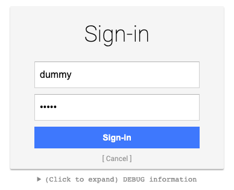
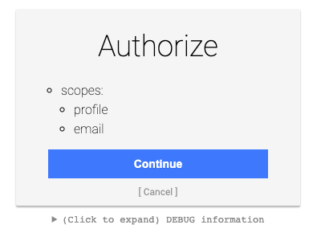

# Recover lost access

!!! caution

    Never configure an alternative login provider without proper testing. Never start to integrate the Magnolia SSO module with any Magnolia instance without the ability to throw away and replace/recover the repository if things do not work out.
    
    In general, it's considered best practice to be able to delete repository data on development instances at any time!

If you did not follow previous advice: You need to re-gain access to a blocked Magnolia instance, and you cannot restore the repository, consider one of the following options.

## Use a mock server

The recommended way to re-gain access to Magnolia AdminCentral is to use a fake server, which lets you access Magnolia with any user / password combination and always applies the **superuser role** to this account.

You can find a guide about how to use a mock server in [Magnolia documentation](https://docs.magnolia-cms.com/magnolia-sso/3.0.0/guides/using-a-mock-oidc-server.html).

You might have to adjust the example on the documentation page to work with your environment and the version of the Magnolia SSO module that you actually use.

### Provide a mock environment

For me, the following combination worked (I used the docker image).

Light module configuration decoration file for my development instance running under **http://localhost:8080/magnoliaAuthor**:

```yaml
authenticationService:
  path: /.magnolia/admincentral
  callbackUrl: http://localhost:8080/magnoliaAuthor/.auth
  postLogoutRedirectUri: http://localhost:8080/magnoliaAuthor/.magnolia/admincentral
  authorizationGenerators:
    fixedRoleAuthorizationGenerator:
      class: info.magnolia.sso.oidc.FixedRoleAuthorizationGenerator
      roles:
        - superuser
  pac4j:
    oidc.id: my-client
    oidc.secret: my-secret
    oidc.scope: openid profile email
    oidc.discoveryUri:  http://localhost:9090/.well-known/openid-configuration
    oidc.preferredJwsAlgorithm: RS256
```

**Docker** command: Mock server running on port 9090:

```shell
docker run \
--env PORT=9090 \
--env CLIENT_ID=my-client \
--env CLIENT_SECRET=my-secret \
--env CLIENT_REDIRECT_URI=http://localhost:8080/magnoliaAuthor/.auth \
--env CLIENT_LOGOUT_REDIRECT_URI=http://localhost:8080/magnoliaAuthor/.magnolia/admincentral \
-p 9090:9090 \
mgnl/mock-oidc-user-server:latest
```

### Access Magnolia

If it works, login is handled by the mock server:





---

## Remove Magnolia SSO configuration

For this solution, you need to be able to adjust and re-deploy your Magnolia WAR bundle.

### Prepare the bundle

**Please study and understand the [documentation](https://docs.magnolia-cms.com/product-docs/6.2/Modules/List-of-modules/Groovy-module.html#_rescue_app) before taking any further action!**

1. Backup your repository and save everything you might need before doing any changes.
2. Rename the file {your-webapp}\src\main\webapp\WEB-INF\config\jaas.config file (e.g. "jaas.config.save").
3. Remove / comment out the Magnolia SSO module in Maven (project **and** webapp POM).
4. Remove / rename light module configuration for Magnolia SSO.
5. Adjust / provide a web.xml according to the dodumentation for the [Rescue App](https://docs.magnolia-cms.com/product-docs/6.2/Modules/List-of-modules/Groovy-module.html#_rescue_app).
6. Stop Magnolia, build and deploy the adjusted bundle and start it.

You now should have a [console](https://docs.magnolia-cms.com/product-docs/6.2/_images/rescue-app.png) provided by the Rescue App in your browser tab.

Execute the following lines in the console (without the comments):

```groovy
session = ctx.getJCRSession('config')

// delete client callback
root = session.getNode('/server/filters/securityCallback/clientCallbacks')
root.getNode('magnolia-sso').remove()

// set default login filter 
root = session.getNode('/server/filters/login')
root.setProperty('class', 'info.magnolia.cms.security.auth.login.LoginFilter')

// set default logout filter
root = session.getNode('/server/filters/logout')
root.setProperty('class', 'info.magnolia.cms.security.LogoutFilter')

// remove module magnolia-sso
root = session.getNode('/modules')
root.getNode('magnolia-sso').remove()

// save your changes!
session.save()
```

Don't forget to save the changes with the last line!

After adjusting the JCR configuration, stop your Magnolia instance and configure (or remove) the **web.xml** file so that the Magnolia filter chain is not any longer ignored (revert [rescue changes](https://docs.magnolia-cms.com/product-docs/6.2/Modules/List-of-modules/Groovy-module.html#_rescue_app)).

Build and deploy the Magnolia bundle and open AdminCentral.

If everything worked as expected, you should be able to use one of your local Magnolia accounts to log in.

!!! note

    By applying the steps outlined above, we didn't completely remove all settings previously done by the Magnolia SSO module. But as we gained (visual) access to AdminCentral again, you can use the UI to perform removal of obsolete configuration entries. To find out about the changes, it's helpful to look at the [version handler](https://docs.magnolia-cms.com/product-docs/6.2/Getting-started-with-Magnolia/FAQ.html#_what_are_version_handlers_and_when_should_i_use_one) of the module.
    The code can be found in [Magnolia Git](https://git.magnolia-cms.com/projects/ENTERPRISE/repos/magnolia-sso/browse/magnolia-sso/src/main/java/info/magnolia/sso/setup/SsoModuleVersionHandler.java). Please check the code version matching the one used in your project.

---

If you can access your Magnolia backend again, grab a coffee and relax!


