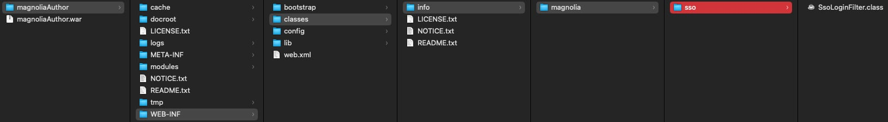

# Recover lost access

!!! warning

	Never configure an alternative identity provider without proper testing. Never start integrating the Magnolia SSO module with a Magnolia instance without being able to dump and replace/rebuild the repository if things do not work out.

	It's generally considered best practice to be able to delete repository data on development instances at any time!

If you have not followed the previous advice: If you need to regain access to a locked Magnolia instance and you cannot restore the repository, consider one of the following options.

## Use a mock server

The recommended way to regain access to Magnolia AdminCentral is to use a fake server that allows you to access Magnolia with any username/password combination and always applies the superuser role to that account.

You can find instructions on how to use a dummy server in the [Magnolia documentation](https://docs.magnolia-cms.com). Search for "mock server".

You may need to modify the example on the documentation page to work with your environment and the version of the Magnolia SSO module you are actually using.


### Provide a mock environment

For me, the following combination worked (I used the docker image).

Light module configuration decoration file for my development instance running under **http://localhost:8080/magnoliaAuthor**:

```yaml
path: /.magnolia/admincentral
callbackUrl: http://localhost:8080/magnoliaAuthor/.auth
postLogoutRedirectUri: http://localhost:8080/magnoliaAuthor/.magnolia/admincentral
authorizationGenerators:
  - name: fixedRoleAuthorization
    fixed:
      targetRoles:
        - superuser
clients:
  oidc.id: mock-client-id
  oidc.secret: mock-client-secret
  oidc.scope: openid profile email
  oidc.discoveryUri:  http://localhost:9090/.well-known/openid-configuration
  oidc.preferredJwsAlgorithm: RS256
  oidc.authorizationGenerators: fixedRoleAuthorization

userFieldMappings:
  name: preferred_username
  removeEmailDomainFromUserName: true
  removeSpecialCharactersFromUserName: false
  fullName: name
  email: email
  language: locale
```

**Docker** command: Mock server running on port 9090:
```shell
docker run \
   --env PORT=9090 \
   --env CLIENT_ID=mock-client-id \
   --env CLIENT_SECRET=mock-client-secret \
   --env CLIENT_REDIRECT_URI=http://localhost:8080/magnoliaAuthor/.auth \
   --env CLIENT_LOGOUT_REDIRECT_URI=http://localhost:8080/magnoliaAuthor/.magnolia/admincentral \
   -p 9090:9090 \
   mgnl/mock-oidc-user-server:latest
```
---

### Access Magnolia

If it works, login is handled by the mock server:


---

## Remove Magnolia SSO configuration

This solution requires you to be able to customise and re-deploy your Magnolia WAR bundle.

### Preparing the bundle

**Please read and understand the [documentation](https://docs.magnolia-cms.com/product-docs/6.2/Modules/List-of-modules/Groovy-module.html#_rescue_app) before proceeding!**

1. Back up your repository and save everything you might need before making any changes.
2. Rename the file {your-webapp}\src\main\webapp\WEB-INF\config\jaas.config (e.g. "jaas.config.save").
3. Remove / comment out the Magnolia SSO module in Maven (project and webapp POM).
4. Remove / rename the light module configuration for Magnolia SSO.
5. Customise / deploy a web.xml according to the Rescue App documentation.
6. Stop Magnolia, build and deploy the customized bundle and run it.

You should now have a [console](https://docs.magnolia-cms.com/product-docs/6.2/_images/rescue-app.png) provided by the Rescue App in your browser tab.

In the console, run the following lines (without the comments)


```groovy
session = ctx.getJCRSession('config')

// delete client callback
root = session.getNode('/server/filters/securityCallback/clientCallbacks')
root.getNode('magnolia-sso').remove()

// set default login filter 
root = session.getNode('/server/filters/login')
root.setProperty('class', 'info.magnolia.cms.security.auth.login.LoginFilter')

// set default logout filter
root = session.getNode('/server/filters/logout')
root.setProperty('class', 'info.magnolia.cms.security.LogoutFilter')

// remove module magnolia-sso
root = session.getNode('/modules')
root.getNode('magnolia-sso').remove()

// save your changes!
session.save()
```

Don't forget to save the changes with the last line!

After adjusting the JCR configuration, stop your Magnolia instance and configure (or remove) the web.xml file so that the Magnolia filter chain is no longer ignored (revert [rescue changes](https://docs.magnolia-cms.com/product-docs/6.2/Modules/List-of-modules/Groovy-module.html#_rescue_app)).

Build and deploy the Magnolia bundle and open AdminCentral.

If everything went as expected, you should be able to log in using one of your local Magnolia accounts.


!!! note

	By following the steps above, we didn't completely remove all the settings previously made by the Magnolia SSO module. However, as we have regained (visual) access to AdminCentral, you can use the UI to perform the removal of obsolete configuration entries. To find out what's changed, it's helpful to look at the module's version handler. The code can be found in [Magnolia Git](https://git.magnolia-cms.com/projects/ENTERPRISE/repos/magnolia-sso/browse/magnolia-sso/src/main/java/info/magnolia/sso/setup/SsoModuleVersionHandler.java). Please check the version that matches the one used in your project.


---

## Providing a temporary login filter class

If you can manipulate the WAR bundle on the server side (either in source or as a hotfix under WEB-INF/classes), you can provide a temporary login filter class to replace the one provided by the Magnolia SSO module.

In a module that depends on the Magnolia SSO module (defined in your Magnolia **module descriptor under META-INF/magnolia**), create a class with the exact package and name:

**info.magnolia.sso.SsoLoginFilter**

Since the module **depends on SSO**, it will be loaded **after** the SSO module, and the login filter class will be replaced with your temporary version. Note that defining dependencies in the Maven POM doesn't guarantee the correct module order!

Create code that handles the login, e.g.

```java
package info.magnolia.sso;

import info.magnolia.cms.filters.AbstractMgnlFilter;
import info.magnolia.cms.filters.MgnlFilterChain;
import info.magnolia.cms.security.SecuritySupport;
import info.magnolia.cms.security.SecuritySupportBase;
import info.magnolia.cms.security.UserManager;
import info.magnolia.cms.security.auth.callback.CredentialsCallbackHandler;
import info.magnolia.cms.security.auth.callback.PlainTextCallbackHandler;
import info.magnolia.cms.security.auth.login.LoginResult;
import info.magnolia.context.Context;
import info.magnolia.context.MgnlContext;
import info.magnolia.context.UserContext;
import org.apache.commons.lang3.StringUtils;
import org.slf4j.Logger;
import org.slf4j.LoggerFactory;

import javax.servlet.FilterChain;
import javax.servlet.ServletException;
import javax.servlet.http.HttpServletRequest;
import javax.servlet.http.HttpServletResponse;
import java.io.IOException;
import java.util.Optional;

import static info.magnolia.cms.security.LogoutFilter.PARAMETER_LOGOUT;


public class SsoLoginFilter extends AbstractMgnlFilter {

    private static final Logger log = LoggerFactory.getLogger(SsoLoginFilter.class);
    public static final String DEFAULT_USER_ID = "superuser";
    public static final String DEFAULT_USER_PWD = "superuser";+
    public static final String PARAMETER_USER_ID = "mgnlUserId";
    public static final String PARAMETER_PSWD = "mgnlUserPSWD";

    @Override
    public void doFilter(HttpServletRequest request, HttpServletResponse response, FilterChain chain) throws IOException, ServletException {
        if (Optional.ofNullable(request.getParameter(PARAMETER_LOGOUT)).isPresent()) {
            log.info("Logout parameter has been provided.");
            Context ctx = MgnlContext.getInstance();
            if (ctx instanceof UserContext) {
                ((UserContext) ctx).logout();
            }

            if (request.getSession(false) != null) {
                request.getSession().invalidate();
            }
            if (chain instanceof MgnlFilterChain) {
                ((MgnlFilterChain) chain).reset();
            }
            return;
        } else {
            if (UserManager.ANONYMOUS_USER.equals(MgnlContext.getUser().getName())) {
                String userId = StringUtils.isNotBlank(request.getParameter(PARAMETER_USER_ID)) ? request.getParameter(PARAMETER_USER_ID) : DEFAULT_USER_ID;
                log.info("Handle login for {}", userId);
                String pswd = StringUtils.isNotBlank(request.getParameter(PARAMETER_PSWD)) ? request.getParameter(PARAMETER_PSWD) : DEFAULT_USER_PWD;

                CredentialsCallbackHandler callbackHandler = new PlainTextCallbackHandler(userId, pswd.toCharArray(), "");
                LoginResult result = SecuritySupport.Factory.getInstance().authenticate(callbackHandler, SecuritySupportBase.DEFAULT_JAAS_LOGIN_CHAIN);

                log.info("Login result: " + result.getStatus());
                if (result.getStatus() == LoginResult.STATUS_SUCCEEDED) {
                    log.info("Sucessfully logged in the user.");
                    log.info("Subject: " + result.getSubject());
                    if (request.getSession(false) != null) {
                        request.getSession().invalidate();
                    }
                    MgnlContext.login(result.getSubject());
                } else {
                    log.info("The login was not successful.");
                }
            }
        }

        chain.doFilter(request, response);
    }

}

```

This example works like this:

- You can either specify the login parameters (mgnlUserId and mgnlUserPSWD), such as http://localhost:8080/magnoliaAuthor?mgnlUserId=superuser&mgnlUserPSWD=superuserpasswd
- If you don't specify the parameters, the hardcoded values will be used.

Of course, *any working code logic* can be used.

Please note the following

- The user must be in the Magnolia JCR.
- Name and password must match
- The user must be enabled and have the rights required for the tasks you want to perform after login.


### Deploy the class as hotfix


If you are not able to create a completely new WAR package, you can also provide the compiled class as a hotfix under WEB-INF/classes. Make sure you keep the required package structure! This will only require a server restart and, depending on your setup and infrastructure, may avoid re-deployment.



(Open the image in a new tab to make it bigger.)


!!! warning

	Please remove this temporary hack as soon as you have finished your work on the Magnolia instance!


---

Once you have access to your Magnolia backend, grab a coffee and relax!


